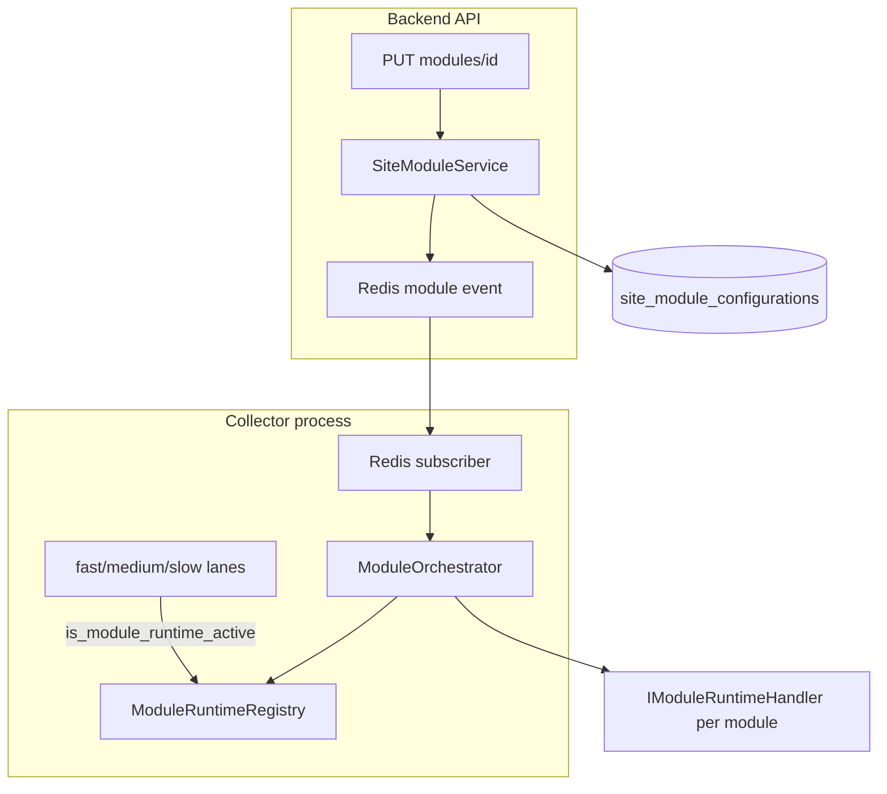

# EMIC Step 2.5 – Runtime Completion

Step 2.5 makes the module platform **runtime-operational**: disable stops workers, runtime status reflects actual state, and the collector gates lane work through `ModuleRuntimeRegistry`.

## Runtime ownership map

| Collector lane / work | Module owner | Type |
|----------------------|--------------|------|
| Heartbeat `fetch_readings` (fast) | `integration.heartbeat` | Lane skip + site filter |
| `market_prices` | `feature.price-engine` | Lane skip |
| `energy_balance` | `feature.energy-balance` | Lane skip per site |
| `smart_charging` | `feature.smart-charging` | Lane skip |
| `spa_integration` | `integration.arctic_spa` | Lane skip |
| `ev_accounting` | `feature.smart-charging` | Lane skip per site |
| `vehicle_charge_sessions` | `feature.vehicles` | Lane skip per site |
| `virtual_bridge` | `integration.heartbeat` + `feature.smart-charging` | Lane skip |
| `ems_shadow` | `feature.energy-control` | Lane skip |
| `solar_forecast` | `feature.solar-forecast` | Lane skip |
| `energy_control` | `feature.energy-control` | Lane skip + fail-safe stop |
| `VehicleIntegrationSupervisor` | `integration.mercedes` | Long-lived handler per site |
| `snapshot_write`, `financial_rollup`, `timescale_retention` | Core (not a module) | Always on |

## Architecture

## Key components

- **`ModuleRuntimeRegistry`** – per-site handle state (`RUNNING`, `STOPPED`, `BLOCKED`, …)
- **`IModuleRuntimeHandler`** – explicit start/stop for long-lived workers (Mercedes); lane modules use noop `LaneModuleHandler`
- **`ModuleOrchestrator`** – idempotent start/stop, `sync_site`, capability register/unregister on lifecycle
- **`SiteModuleService`** – persist override + Redis pub/sub; collector applies runtime via orchestrator
- **`is_module_runtime_active`** – DB enabled **and** registry `RUNNING`

## Cross-process signalling

Backend and collector are separate processes. Module PUT persists to DB and publishes on `emic:events:modules`. Collector subscribes and calls `start_module` / `stop_module`. Fallback: `mark_site_modules_dirty` + `sync_dirty_module_sites` at lane cycle start.

## Rollback

1. `EMIC_MODULE_GATE_ENABLED=false` – bypasses runtime gates
2. Redis failure – collector falls back to dirty-site sync each lane cycle
3. No new DB migration required

## Scope boundaries (NOT Step 2.5)

- Step 3 integration migrations
- Module Store / SDK / dynamic plugins
- Full projection refactor away from vendor repos
- Prod Charge Amps disable on akarp during active charging
