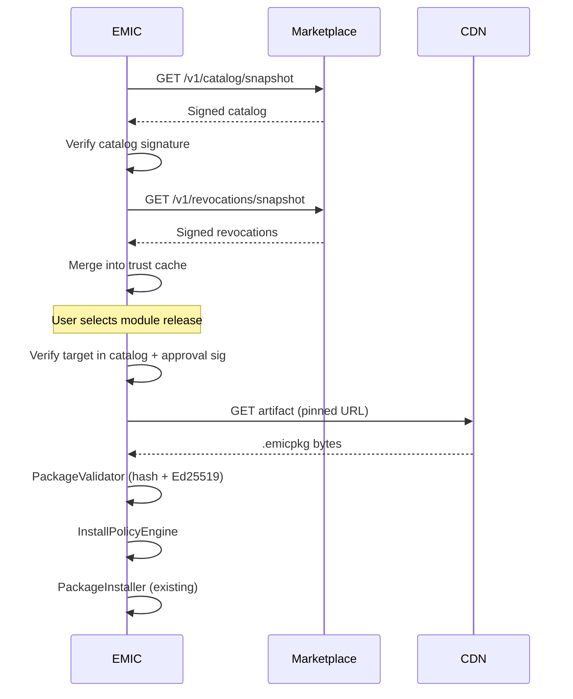

# EMIC Module Marketplace API Design

**Date:** 2026-09-07  
**Scope:** Step 5C design — endpoint contracts, installation client flow, auth separation  
**Status:** Contract only — no routes implemented

---

## 1. Overview

The Marketplace API is a **read-heavy, signed-metadata** service. EMIC installations consume signed snapshots; mutations are publisher/admin authenticated on separate paths. Package integrity is always verified locally via existing `PackageValidator`.

**Base URL (design):** `https://marketplace.emic.example`

---

## 2. Public Read Endpoints

### 2.1 Catalog Snapshot

```
GET /v1/catalog/snapshot
```

Returns signed **TUF** catalog metadata target (`emic/catalog.json`) — see [`EMIC_TUF_METADATA_MODEL.md`](../security/EMIC_TUF_METADATA_MODEL.md).

**Response:** `200 application/json`

| Field | Description |
|-------|-------------|
| `snapshot.version` | Monotonic catalog version |
| `snapshot.expires_at` | ISO8601 expiry |
| `targets` | Map module_id → latest release metadata |
| `signatures.catalog` | Ed25519 signature over canonical JSON |

**Errors:**

| Status | Condition |
|--------|-----------|
| 503 | Service unavailable — EMIC uses cached snapshot |
| 429 | Rate limited |

**Caching:** `Cache-Control: public, max-age=300`; ETag by snapshot version.

---

### 2.2 Module List

```
GET /v1/catalog/modules?channel=stable&publisher_tier=VERIFIED
```

Paginated module listings (unsigned browse metadata — install still requires signed snapshot target).

**Query params:**

| Param | Type | Description |
|-------|------|-------------|
| `channel` | string | `stable`, `beta` |
| `publisher_tier` | string | Filter by tier |
| `capability` | string | Filter by capability class |
| `page` | int | Pagination |
| `page_size` | int | Max 100 |

**Response:**

```json
{
  "modules": [
    {
      "module_id": "integration.vendor-x",
      "display_name": "Vendor X Integration",
      "publisher_id": "vendor-x",
      "publisher_tier": "VERIFIED",
      "latest_stable": "2.1.0",
      "risk_class": "HIGH",
      "capabilities_summary": ["device.read", "telemetry.publish"]
    }
  ],
  "page": 1,
  "total": 42
}
```

---

### 2.3 Module Releases

```
GET /v1/catalog/modules/{module_id}/releases?channel=stable
```

**Response:**

```json
{
  "module_id": "integration.vendor-x",
  "releases": [
    {
      "release_id": "integration.vendor-x@2.1.0",
      "version": "2.1.0",
      "release_sequence": 8,
      "channel": "stable",
      "content_sha256": "...",
      "artifact_url": "https://cdn.emic.example/...",
      "published_at": "2026-08-15T10:00:00Z",
      "publisher_key_id": "vendor-x:2025-01",
      "approval_key_id": "emic-release-v1",
      "permissions": ["network.external"],
      "capabilities": ["device.read"],
      "dependencies": [],
      "risk_class": "HIGH"
    }
  ]
}
```

Release list is informational; **install client must verify entry exists in signed catalog snapshot** before trust.

---

### 2.4 Revocation Snapshot

```
GET /v1/revocations/snapshot
```

Signed revocation bundle (data model §5.2).

**Response:** `200 application/json` with `bundle.version`, `revocations[]`, `signatures.revocation`.

---

### 2.5 Security Advisories

```
GET /v1/advisories?module_id={id}&severity=CRITICAL
```

**Response:**

```json
{
  "advisories": [
    {
      "advisory_id": "EMIC-2026-001",
      "module_id": "integration.vendor-x",
      "affected_versions": ["<2.1.1"],
      "severity": "HIGH",
      "fixed_in_version": "2.1.1",
      "published_at": "2026-09-01T00:00:00Z",
      "summary": "..."
    }
  ]
}
```

---

## 3. Publisher Endpoints (Future — Design Only)

All require publisher OAuth token + MFA for Verified tier.

```
POST   /v1/publisher/register              # COMMUNITY tier only
POST   /v1/publisher/verification          # Submit VERIFIED evidence
GET    /v1/publisher/me
POST   /v1/publisher/keys                  # Register public key
POST   /v1/publisher/keys/{key_id}/revoke  # Self-revoke
POST   /v1/publisher/releases              # Submit release metadata
POST   /v1/publisher/releases/{id}/artifact # Upload to staging CDN
GET    /v1/publisher/releases/{id}/status  # Approval pipeline status
```

**Not implemented in Step 5C.**

---

## 4. Marketplace Admin Endpoints (Future — Design Only)

Separate admin IAM — no shared tokens with publisher API.

```
POST   /v1/admin/releases/{id}/approve
POST   /v1/admin/releases/{id}/reject
POST   /v1/admin/revocations
POST   /v1/admin/publishers/{id}/tier
POST   /v1/admin/catalog/publish           # Trigger snapshot rebuild
```

---

## 5. EMIC Installation Client Flow



### Step detail

1. **Catalog sync** — Background job or on-demand before remote install. Cache to disk with expiry.
2. **Revocation sync** — Same interval; merge scopes into local DB/cache.
3. **Release selection** — UI or API picks module_id + version from catalog targets.
4. **Metadata verification** — Verify publisher release signature + Marketplace approval signature on release record (canonical JSON).
5. **Download** — HTTPS GET pinned `artifact_url`; verify `content_sha256` before writing temp file.
6. **Package validation** — Existing `PackageValidator.validate()` — no shortcuts.
7. **Policy check** — `InstallPolicyEngine` evaluates tier, revocation, advisories, org allowlist.
8. **Install** — Existing `PackageInstaller.install()` path.
9. **Enable** — Unchanged site module flow (install ≠ enable).

### Failure modes

| Failure | Client behavior |
|---------|-----------------|
| Catalog signature invalid | Abort; use cache if fresh; else block remote install |
| Artifact hash mismatch | Abort; do not write to install dir |
| Package signature invalid | Abort; quarantine if replacing existing |
| Revocation hit | Block install; quarantine if already installed |
| Policy denied | Return structured reason to UI |
| CDN 404 | Retry with backoff; fail with user message |

---

## 6. Auth Separation

| Identity | Used for | Must NOT access |
|----------|----------|-----------------|
| Publisher token | Submit releases, manage keys | Other publishers' data, admin approval |
| Marketplace admin | Approve, revoke, tier change | EMIC device APIs |
| EMIC admin token | Local policy, local upload, break-glass | Marketplace publisher mutations |
| Install telemetry ID | Anonymous install counts | Device credentials, site data |

**Install telemetry ID:** Opaque UUID generated at EMIC install time; optional `POST /v1/telemetry/install` (future) with module_id, version, result — no PII.

---

## 7. Rate Limiting & Abuse Model

| Endpoint | Limit | Rationale |
|----------|-------|-----------|
| `/v1/catalog/snapshot` | 60/hour/install ID | CDN should absorb; fallback cache |
| `/v1/revocations/snapshot` | 120/hour/install ID | Fresher for CRITICAL |
| `/v1/catalog/modules` | 300/hour/IP | Browse abuse |
| Publisher upload | 10/day/community; tier quotas | Storage abuse |
| Artifact CDN | Size cap 50MB default | Zip bomb prevention |

**Abuse responses:** 429 with `Retry-After`; repeated abuse → temporary install ID block (telemetry only — local install unaffected).

---

## 8. Integration with Step 5B Backend

Remote install (5C.3) adds EMIC-side endpoints — **not** Marketplace routes:

```
POST /api/modules/packages/remote/validate   # Fetch + validate only
POST /api/modules/packages/remote/install    # Fetch + validate + install
POST /api/modules/marketplace/sync           # Admin: force catalog/revocation sync
GET  /api/modules/marketplace/status           # Cache age, staleness, degraded mode
```

These proxy the client flow above and delegate to `PackageValidator` + `PackageInstaller`. Admin auth required.

Local upload endpoints unchanged.

---

## 9. Error Contract

Structured errors (consistent with Step 5B `apiError` pattern):

```json
{
  "error_code": "CATALOG_SIGNATURE_INVALID",
  "message": "Catalog snapshot signature verification failed",
  "details": {
    "snapshot_version": 41,
    "key_id": "emic-catalog-v1"
  }
}
```

| Code | HTTP | Meaning |
|------|------|---------|
| `CATALOG_EXPIRED` | 422 | Snapshot past expires_at |
| `CATALOG_SIGNATURE_INVALID` | 422 | Crypto failure |
| `REVOCATION_STALE` | 503 | Feed beyond SLA — degraded |
| `RELEASE_NOT_APPROVED` | 422 | Missing approval signature |
| `ARTIFACT_HASH_MISMATCH` | 422 | CDN bytes ≠ signed hash |
| `POLICY_DENIED` | 403 | Org policy block |
| `PUBLISHER_REVOKED` | 403 | Revocation feed hit |
| `TIER_NOT_ALLOWED` | 403 | e.g. COMMUNITY in prod |

---

## 10. Versioning

- API prefix `/v1/` — breaking changes increment major
- Catalog snapshot includes `root_version` for key rotation
- EMIC client supports N and N-1 root keys during rotation overlap

---

## 11. Out of Scope

- Implemented routes
- OAuth provider selection
- CDN infrastructure
- Payment webhooks

---

## 12. References

- [EMIC_MODULAR_ARCHITECTURE_STEP5C.md](./EMIC_MODULAR_ARCHITECTURE_STEP5C.md)
- [EMIC_MODULE_MARKETPLACE_DATA_MODEL.md](./EMIC_MODULE_MARKETPLACE_DATA_MODEL.md)
- [EMIC_MODULE_TRUST_MODEL.md](../security/EMIC_MODULE_TRUST_MODEL.md)
- `backend/app/api/module_packages.py` (existing local install)
