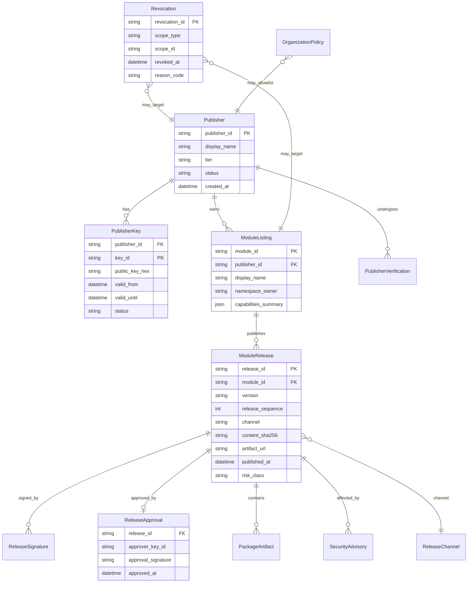

# EMIC Module Marketplace Data Model

**Date:** 2026-09-07  
**Scope:** Step 5C design — entity relationships, JSON schema sketches, mapping to existing EMIC tables  
**Status:** Design only — no migrations in this phase

---

## 1. Overview

The Marketplace data model extends Step 5B's local trust and install tables with **remote governance entities**. EMIC installations retain authoritative local state in `installed_module_packages` and `module_publisher_keys`; Marketplace holds catalog, release approval, and revocation truth for sync.

---

## 2. Entity-Relationship Diagram



---

## 3. Entities

### 3.1 Publisher

| Column | Type | Notes |
|--------|------|-------|
| `publisher_id` | string (PK) | Stable ID, e.g. `emic`, `acme-energy` |
| `display_name` | string | Human-readable |
| `tier` | enum | `OFFICIAL`, `VERIFIED`, `ORG_APPROVED`, `COMMUNITY`, `REVOKED` |
| `status` | enum | `ACTIVE`, `SUSPENDED`, `REVOKED` |
| `contact_email` | string | Verification contact |
| `created_at` | datetime | |

### 3.2 PublisherKey (extends `ModulePublisherKeyModel`)

| Column | Type | Notes |
|--------|------|-------|
| `publisher_id` | string (FK) | |
| `key_id` | string (PK composite) | Matches package `signature.json` |
| `public_key_hex` | text | Ed25519 public key |
| `valid_from` | datetime | Key rotation start |
| `valid_until` | datetime nullable | Expired keys rejected |
| `status` | enum | `TRUSTED`, `REVOKED`, `EXPIRED` |
| `tier_at_issue` | enum | Tier when key was issued |

**Mapping to existing:** `module_publisher_keys` gains `valid_from`, `valid_until`, `tier_at_issue` in future migration. Local EMIC syncs subset from Marketplace + org overrides.

### 3.3 ModuleListing

| Column | Type | Notes |
|--------|------|-------|
| `module_id` | string (PK) | Canonical ID, e.g. `integration.vendor-x` |
| `publisher_id` | string (FK) | Must own namespace |
| `display_name` | string | |
| `description` | text | |
| `namespace_owner` | string | Registry proof |
| `capabilities_summary` | json | Declared capability classes for Store display |
| `status` | enum | `DRAFT`, `PUBLISHED`, `DEPRECATED`, `REVOKED` |

### 3.4 ModuleRelease

| Column | Type | Notes |
|--------|------|-------|
| `release_id` | string (PK) | UUID or deterministic `{module_id}@{version}` |
| `module_id` | string (FK) | |
| `version` | string | SemVer |
| `release_sequence` | int | Monotonic per module — replay protection |
| `channel` | string | `stable`, `beta`, `internal` |
| `content_sha256` | string | Package content hash |
| `artifact_url` | string | HTTPS pinned URL |
| `artifact_size_bytes` | int | |
| `manifest_digest` | string | Canonical manifest hash |
| `published_at` | datetime | Signed timestamp |
| `min_emic_version` | string nullable | Platform compatibility |
| `permissions` | json | From manifest |
| `capabilities` | json | From manifest |
| `dependencies` | json | Explicit module_id list |
| `sbom_ref` | string nullable | CycloneDX location |
| `risk_class` | enum | `CRITICAL`, `HIGH`, `NORMAL`, `LOW` |

### 3.5 ReleaseSignature

Publisher signature over release metadata record (not re-signing entire ZIP).

| Column | Type | Notes |
|--------|------|-------|
| `release_id` | string (FK) | |
| `signer_type` | enum | `PUBLISHER` |
| `key_id` | string | |
| `signature_hex` | text | Ed25519 over canonical release JSON |

### 3.6 ReleaseApproval

Marketplace two-party approval signature.

| Column | Type | Notes |
|--------|------|-------|
| `release_id` | string (FK) | |
| `approver_key_id` | string | Marketplace release signing key |
| `approval_signature_hex` | text | Ed25519 over approval payload |
| `approved_at` | datetime | |
| `reviewer_id` | string | Audit — human or automated policy ID |

### 3.7 PackageArtifact

| Column | Type | Notes |
|--------|------|-------|
| `artifact_id` | string (PK) | |
| `release_id` | string (FK) | |
| `url` | string | CDN URL |
| `content_sha256` | string | Must match release |
| `media_type` | string | `application/vnd.emic.emicpkg+zip` |
| `cdn_region` | string nullable | |

### 3.8 Revocation (polymorphic)

| Column | Type | Notes |
|--------|------|-------|
| `revocation_id` | string (PK) | |
| `scope_type` | enum | `PUBLISHER`, `KEY`, `MODULE`, `VERSION`, `HASH`, `CHANNEL` |
| `scope_id` | string | Target identifier |
| `scope_version` | string nullable | For VERSION scope |
| `revoked_at` | datetime | |
| `reason_code` | string | `KEY_COMPROMISE`, `MALWARE`, `POLICY`, `VOLUNTARY` |
| `effective_until` | datetime nullable | Temporary suspension |

### 3.9 SecurityAdvisory

| Column | Type | Notes |
|--------|------|-------|
| `advisory_id` | string (PK) | |
| `module_id` | string (FK) | |
| `affected_versions` | json | Version range |
| `severity` | enum | CVE-aligned |
| `fixed_in_version` | string nullable | |
| `published_at` | datetime | |

### 3.10 ReleaseChannel

| Column | Type | Notes |
|--------|------|-------|
| `channel_id` | string (PK) | `stable`, `beta` |
| `description` | string | |
| `auto_update_policy` | enum | Design only — `MANUAL`, `NOTIFY`, `AUTO` (org-controlled) |

### 3.11 OrganizationPolicy (EMIC-side, future)

| Column | Type | Notes |
|--------|------|-------|
| `org_id` | string (PK) | |
| `allowed_tiers` | json | e.g. `["OFFICIAL", "VERIFIED"]` |
| `publisher_allowlist` | json | Optional explicit list |
| `control_module_policy` | enum | `OFFICIAL_ONLY`, `VERIFIED_OK` |
| `break_glass_enabled` | bool | Non-CRITICAL revocation override |

### 3.12 PublisherVerification

| Column | Type | Notes |
|--------|------|-------|
| `verification_id` | string (PK) | |
| `publisher_id` | string (FK) | |
| `verification_type` | enum | `DOMAIN`, `LEGAL_ENTITY`, `MANUAL_REVIEW` |
| `status` | enum | `PENDING`, `APPROVED`, `REJECTED` |
| `evidence_ref` | string | Secure storage pointer |
| `verified_at` | datetime nullable | |

---

## 4. Mapping to Existing EMIC Tables

| Marketplace entity | Existing EMIC table | Relationship |
|--------------------|----------------------|--------------|
| `PublisherKey` | `module_publisher_keys` | Local cache + org allowlist; sync from Marketplace |
| Installed package | `installed_module_packages` | Authoritative on EMIC; not in Marketplace |
| Site enablement | `site_module_configurations` | Per-site; unchanged |
| Runtime truth | Redis `module_runtime_state` | Local only |
| Internal catalog | `EMIC_MODULE_CATALOG_PATH` JSON | Coexists; local upload path unchanged |

**Rule:** Marketplace never stores installation-specific state. EMIC never treats Marketplace as sole source for local install without signature verification.

---

## 5. JSON Schema Sketches

### 5.1 Signed Catalog Metadata (TUF targets)

Step 5C.1 implements catalog as a **TUF targets** entry (`emic/catalog.json`), verified via full root→timestamp→snapshot→targets chain. See [`EMIC_TUF_METADATA_MODEL.md`](../security/EMIC_TUF_METADATA_MODEL.md).

```json
{
  "snapshot": {
    "version": 42,
    "expires_at": "2026-09-08T00:00:00Z",
    "generated_at": "2026-09-07T12:00:00Z"
  },
  "root_keys": {
    "catalog_key_id": "emic-catalog-v1",
    "revocation_key_id": "emic-revoke-v1",
    "root_version": 3
  },
  "targets": {
    "modules/integration.demo": {
      "latest_stable": "1.2.0",
      "release_sequence": 15,
      "content_sha256": "abc123...",
      "artifact_url": "https://cdn.emic.example/packages/integration.demo-1.2.0.emicpkg",
      "publisher_id": "emic",
      "release_approval_key_id": "emic-release-v1",
      "published_at": "2026-09-01T10:00:00Z"
    }
  },
  "signatures": {
    "catalog": {
      "key_id": "emic-catalog-v1",
      "signature_hex": "..."
    }
  }
}
```

Canonical JSON (sorted keys) is signed. EMIC verifies catalog signature before trusting any target entry.

### 5.2 Signed Revocation Bundle

```json
{
  "bundle": {
    "version": 108,
    "expires_at": "2026-09-08T06:00:00Z",
    "generated_at": "2026-09-07T06:00:00Z"
  },
  "revocations": [
    {
      "scope_type": "KEY",
      "scope_id": "acme:key-2024-01",
      "revoked_at": "2026-09-06T14:00:00Z",
      "reason_code": "KEY_COMPROMISE"
    },
    {
      "scope_type": "VERSION",
      "scope_id": "integration.vendor-x",
      "scope_version": "2.0.1",
      "revoked_at": "2026-09-05T09:00:00Z",
      "reason_code": "MALWARE"
    }
  ],
  "signatures": {
    "revocation": {
      "key_id": "emic-revoke-v1",
      "signature_hex": "..."
    }
  }
}
```

### 5.3 Release Approval Record

```json
{
  "release_id": "integration.demo@1.2.0",
  "module_id": "integration.demo",
  "version": "1.2.0",
  "content_sha256": "abc123...",
  "publisher_id": "emic",
  "publisher_key_id": "emic-prod-1",
  "release_sequence": 15,
  "approved_at": "2026-09-01T11:00:00Z",
  "approver_key_id": "emic-release-v1",
  "approval_signature_hex": "..."
}
```

Publisher package signature remains inside `.emicpkg`; approval signs this metadata record binding hash + version + sequence.

---

## 6. Index and Query Patterns

| Query | Index |
|-------|-------|
| List modules by publisher | `ModuleListing.publisher_id` |
| Latest release per module | `ModuleRelease(module_id, channel, release_sequence DESC)` |
| Active revocations | `Revocation(revoked_at)` + scope |
| Org allowlist lookup | `OrganizationPolicy.publisher_allowlist` (GIN/json) |
| Advisory by module | `SecurityAdvisory.module_id` |

---

## 7. Out of Scope (This Phase)

- SQL migrations
- Marketplace database implementation
- Payment/licensing entities
- Ratings/reviews tables
- Community social graph

---

## 8. References

- [EMIC_MODULAR_ARCHITECTURE_STEP5C.md](./EMIC_MODULAR_ARCHITECTURE_STEP5C.md)
- [EMIC_MODULE_MARKETPLACE_API_DESIGN.md](./EMIC_MODULE_MARKETPLACE_API_DESIGN.md)
- `packages/energy-core/src/energy_core/db/models/module_publisher_key.py`
- `alembic/versions/063_installed_module_packages.py`
