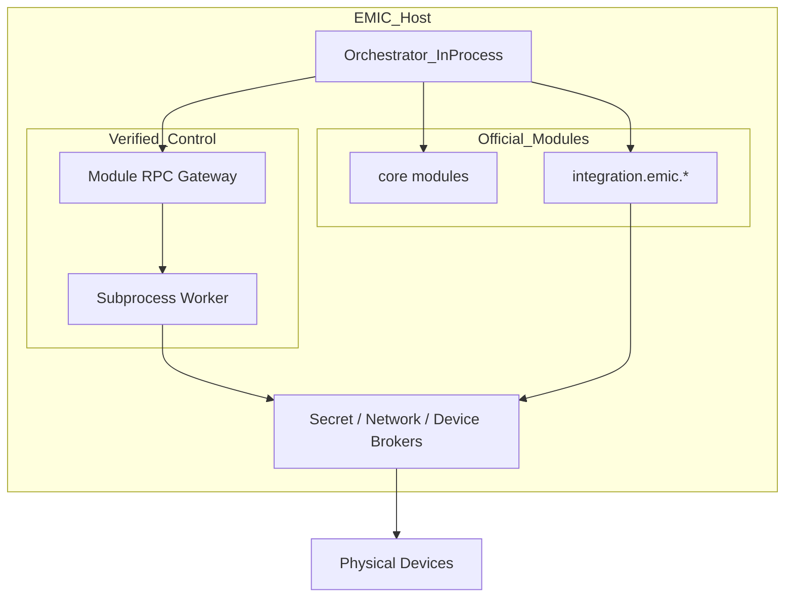

# EMIC Module Runtime Isolation

**Date:** 2026-09-07  
**Scope:** Step 5C design — isolation comparison, tiered recommendation, Module RPC, brokers  
**Status:** Design only — subprocess isolation in Phase 5C.5

---

## 1. Problem Statement

Step 5B runs all modules **in-process** via `importlib` in the collector orchestrator. This is acceptable for Official EMIC modules with supply-chain controls but insufficient for **Verified third-party control modules** that can command chargers, vehicles, and energy equipment.

Step 5C defines a **tiered isolation strategy** without breaking the existing pipeline for Official modules.

---

## 2. Comparison Matrix (§47)

Scored 1 (poor) – 5 (excellent) for EMIC edge deployment context (Windows + Linux, hardware access, single-host).

| Criterion | In-process | Subprocess + IPC | Container | WASM/WASI | gRPC Sidecar |
|-----------|------------|------------------|-----------|-----------|--------------|
| **Security** | 2 | 4 | 5 | 4 | 4 |
| **Performance** | 5 | 4 | 3 | 3 | 3 |
| **Complexity** | 5 | 3 | 2 | 2 | 2 |
| **Hardware access** | 5 | 4 | 3 | 1 | 4 |
| **Windows support** | 5 | 4 | 3 | 3 | 4 |
| **Linux support** | 5 | 5 | 5 | 4 | 5 |
| **Deployment fit** | 5 | 4 | 2 | 3 | 2 |
| **Step 5B reuse** | 5 | 4 | 1 | 1 | 2 |

### Analysis

- **In-process:** Zero IPC overhead; full Python access to Core — unacceptable for untrusted control code long-term.
- **Subprocess + IPC:** Best balance for EMIC — separate address space, still native Python modules, feasible on edge without Docker requirement.
- **Container:** Strong isolation but heavy for home/edge EMIC hosts; ops burden.
- **WASM/WASI:** Good sandbox; poor fit for existing Python module SDK and hardware drivers.
- **gRPC sidecar:** Similar to subprocess but heavier lifecycle; better for multi-service cloud, not single-host edge.

**Recommendation:** Tiered — in-process for Official; subprocess for Verified control; containers optional for enterprise managed deployments (future).

---

## 3. Tiered Strategy (§48)

| Publisher tier | Module class | Runtime | Phase |
|----------------|--------------|---------|-------|
| OFFICIAL | Any | In-process (current) | Now |
| VERIFIED | Read-only / telemetry | In-process + broker-enforced permissions | 5C.5 phase 1 |
| VERIFIED | Device / energy control | **Subprocess + Module RPC** | 5C.5 phase 2 |
| ORG_APPROVED | Policy-dependent | Match VERIFIED or in-process per org | 5C.5+ |
| COMMUNITY | Any | Not installable in production | N/A |
| REVOKED | Any | Stopped / quarantined | Now |

### Module class detection

Derived from manifest capabilities and permissions:

| Class | Signals |
|-------|---------|
| **Control** | `device.control`, `charger.command`, `vehicle.command`, `spa.control`, write-class device permissions |
| **Read-only** | `device.read`, `telemetry.publish`, no control capabilities |
| **Integration** | External network + read; policy assigns HIGH risk |

---

## 4. Architecture



---

## 5. Module RPC Contract (§50)

Transport: **JSON-RPC 2.0** over Unix domain socket (Linux) or named pipe (Windows). Alternative: gRPC over same transport if codegen investment justified.

### 5.1 Lifecycle

| Method | Params | Returns | Description |
|--------|--------|---------|-------------|
| `module.start` | `{module_id, config}` | `{status}` | Spawn/load worker |
| `module.stop` | `{module_id}` | `{status}` | Graceful shutdown |
| `module.health` | `{module_id}` | `{healthy, details}` | Health check |

### 5.2 Capabilities

| Method | Params | Returns |
|--------|--------|---------|
| `module.capabilities` | `{module_id}` | `{capabilities[]}` |
| `module.read` | `{module_id, capability, params}` | `{data}` |
| `module.command` | `{module_id, capability, command, params}` | `{result}` — via device control broker |

### 5.3 Configuration

| Method | Params | Returns |
|--------|--------|---------|
| `module.config.get` | `{module_id, key?}` | `{config}` |
| `module.config.set` | `{module_id, key, value}` | `{ok}` — broker validates schema |

### 5.4 Events (optional)

Worker → host notifications over same socket (reverse channel or separate pub/sub):

```json
{"method": "module.event", "params": {"module_id": "...", "event": "telemetry", "payload": {...}}}
```

### 5.5 Error codes

| Code | Meaning |
|------|---------|
| `-32001` | Module not running |
| `-32002` | Capability denied |
| `-32003` | Broker rejected command |
| `-32004` | Config validation failed |

---

## 6. Brokers (Design Only)

### 6.1 Secret Broker (§52)

- Module requests secret by **declared key name** only (from manifest `secrets` list)
- Broker verifies: module_id owns key, site scope, permission `secrets.read_own`
- In-process modules: broker API (Phase 1); isolated modules: IPC proxy (Phase 2)
- Never expose raw secret store to module process memory when isolated

### 6.2 Network Policy Broker (§53)

- Declarative permissions: `network.external`, `network.local`
- In-process: document-only until OS enforcement (Phase 1)
- Isolated subprocess: firewall rules or proxy — block by default, allow declared hosts/ports
- Verified control modules with external network: explicit org opt-in

### 6.3 Filesystem Broker (§54)

- Module write paths limited to `{EMIC_DATA}/modules/{module_id}/`
- Read paths: manifest-declared only
- Isolated: chroot or OS-level path restrictions

### 6.4 Device Control Broker (§55)

All high-risk commands pass through:

```
Module → RPC command → DeviceControlBroker → CapabilityRegistry → SitePolicy → DeviceAdapter
```

Checks:

1. Module declares capability in manifest
2. Module has permission class
3. Site module enabled for site
4. Publisher tier meets control requirements
5. Revocation feed fresh (CRITICAL)
6. Command in allowlist for capability class

Audit log every command with module_id, capability, command, site_id, result.

---

## 7. Physical Control Safety (§59)

Safe-state behavior when module quarantined or subprocess crashes:

| Capability class | Safe state |
|------------------|------------|
| EV charger control | Stop charging; retain last safe current limit |
| Vehicle commands | Halt pending commands; no new commands |
| SPA / HVAC | Idle mode; no heating override |
| Battery inverter | Hold last known safe setpoint; alert operator |
| Read-only telemetry | No physical action |

Broker implements safe-state **before** tearing down subprocess. Official in-process modules use same broker for consistency (future).

---

## 8. Migration Path

| Phase | Change |
|-------|--------|
| Step 5B (now) | All in-process; permissions install-time |
| 5C.1–5C.3 | No runtime change |
| 5C.5 phase 1 | Broker APIs for secrets/network; in-process Official + Verified read-only |
| 5C.5 phase 2 | Subprocess wrapper for Verified control; orchestrator delegates via RPC |
| Future | Optional container runtime for enterprise |

**Orchestrator change:** Adapter pattern — `InProcessModuleAdapter` (current) vs `IsolatedModuleAdapter` (RPC). Module SDK unchanged for Official; isolated modules use thin worker bootstrap.

---

## 9. Failure Modes

| Event | Behavior |
|-------|----------|
| Subprocess crash | Restart with backoff; quarantine after N failures; safe-state |
| RPC timeout | Mark unhealthy; stop routing commands |
| Broker deny | Return error to module; audit |
| Revocation during run | CRITICAL → safe-state + stop; NORMAL → notify admin |

---

## 10. Testing Strategy (Future Implementation)

- Unit: RPC contract, broker policy matrix
- Integration: isolated module install + command + quarantine
- Negative: escape attempts (path traversal, undeclared network, cross-module secret)
- Chaos: subprocess kill during active charge command → safe-state

---

## 11. Out of Scope

- Subprocess implementation
- Container orchestration
- WASM runtime
- Kernel seccomp profiles (optional hardening later)

---

## 12. References

- [EMIC_MODULAR_ARCHITECTURE_STEP5C.md](./EMIC_MODULAR_ARCHITECTURE_STEP5C.md)
- [EMIC_MODULE_TRUST_MODEL.md](../security/EMIC_MODULE_TRUST_MODEL.md)
- [docs/module-sdk/permissions.md](../module-sdk/permissions.md)
- `packages/energy-core/src/energy_core/platform/modules/orchestrator.py`
- `packages/energy-core/src/energy_core/platform/modules/packages/loader.py`
