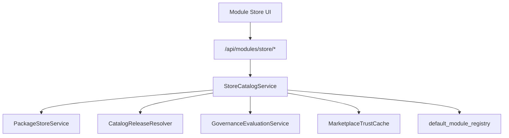

# EMIC Sprint D — Module Store Architecture

**Date:** 2026-09-08  
**Scope:** Unified Module Store backend projection + admin UI  
**Status:** Implemented

---

## Overview

Sprint D delivers a first-class **Module Store** experience for EMIC administrators without weakening security boundaries established in Sprints A–C.

Production remains dormant:

```text
THIRD_PARTY_RUNTIME_ENABLED=false
CONTROL_ISOLATION_GATE_OPEN=false
```

The Store may discover, display, verify, analyze, and stage modules where policy permits. It must not RUN blocked third-party or control-capable modules.

---

## Architecture



### Source precedence

Deterministic merge order for duplicate `module_id`:

1. LOCAL / INTERNAL catalog
2. ORG
3. INSTALLED packages
4. BUILT_IN registry
5. PUBLIC marketplace cache

---

## Key components

| Component | Path |
|-----------|------|
| Store aggregation | `packages/energy-core/.../store/catalog_service.py` |
| Store API | `backend/app/api/module_store.py` |
| Store UI | `frontend/src/components/modules-devices/store/` |

---

## Security integration

- All trust, policy, compatibility, and primary-action decisions are **backend-authoritative**
- Preflight endpoint is **read-only**
- Install delegates to existing `ArtifactStagingService` / `PackageInstaller`
- Publisher content sanitized server-side (`store_content.py`) and client-side (`SafeMarkdown.tsx`)

---

## Related docs

- [EMIC_MODULE_STORE_API.md](./EMIC_MODULE_STORE_API.md)
- [EMIC_MODULE_STORE_UI.md](./EMIC_MODULE_STORE_UI.md)
- [../security/EMIC_MODULE_STORE_SECURITY.md](../security/EMIC_MODULE_STORE_SECURITY.md)
- [EMIC_SPRINT_D_RESULT.md](./EMIC_SPRINT_D_RESULT.md)
