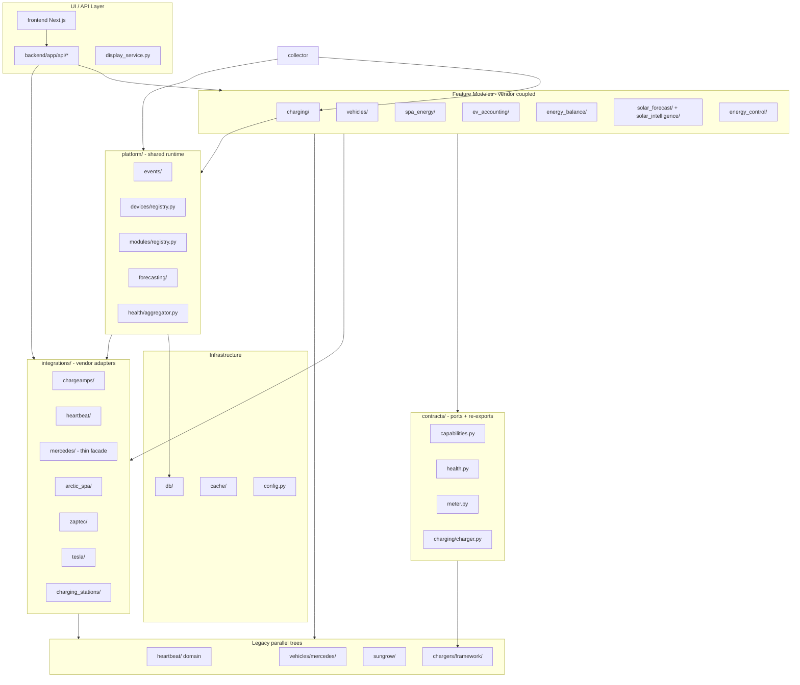

# EMIC Step 1 Architecture Verification

**Date:** 2026-09-07 (re-verified after Step 1 completion sprint 2)  
**Scope:** Read-only verification of Step 1 Modular Monolith goals  
**References:**
- [EMIC_MODULAR_ARCHITECTURE_STEP1.md](./EMIC_MODULAR_ARCHITECTURE_STEP1.md) (target)
- [EMIC_MODULAR_ARCHITECTURE_STEP1_RESULT.md](./EMIC_MODULAR_ARCHITECTURE_STEP1_RESULT.md) (claimed delivery — verified, not trusted blindly)

**Method:** Full codebase grep, AST import analysis, architecture test review, reference-chain tracing, test inventory, performance baseline comparison. No production code was modified.

**Important context:** The repository has progressed **beyond Step 1** since 2026-09-05 (Steps 2–4: Charge Amps/Heartbeat in `integrations/`, schema/ORM split, events, shim removal). This report evaluates Step 1 goals against **current code**, and flags where RESULT documentation is stale.

---

## 1. Executive Summary

Step 1 established a **real but incomplete** modular foundation: `contracts/`, `platform/`, `mocks/`, architecture tests, unified `HealthStatus`, lifted event bus, and registry-based factory dispatch. These deliverables exist and are partially exercised.

However, Step 1 also required that **capability model and device registry be adopted in runtime code**, that feature modules consume contracts rather than vendor clients, and that Core remain vendor-free. Verification shows:

- **Capability model:** adopted in `charging/engine.py` and `ChargingCommandController` via `supports()` — **met** for charging path.
- **Device registry:** adopted via `GET /api/sites/{slug}/devices` and EV diagnostics panel — **met**.
- **Module registry:** populated at backend/collector startup via `register_default_modules()` — **met**.
- **Feature modules:** **zero** direct `integrations.*` imports in feature prefixes (architecture test baseline **empty**).
- **Reference integration (Charge Amps):** traceable end-to-end; meter path unified via `MeterReaderFactory`.
- **Architecture tests:** exceed Step 1 claims — all baselines empty including feature integrations.
- **Legacy cleanup:** root shims removed; parallel trees `heartbeat/`, `vehicles/mercedes/`, `sungrow/` remain (Step 2+ scope).

**STEP 1 READINESS SCORE: 78 / 100**

**Decision: GO FOR STEP 2**

Remaining work is incremental (legacy tree migration, resilience gaps) — not blocking Step 2 start.

---

## 2. Current Modular Architecture



**Layers present:** contracts, platform, integrations (partial), mocks, feature modules, infrastructure.  
**Missing in practice:** strict dependency enforcement from features → contracts only; capability-driven dispatch; runtime module registration.

---

## 3. Dependency Analysis

### Target direction

```text
UI / API  →  Feature Modules  →  Contracts / Domain  ←  Integration Adapters
Infrastructure (db, cache, config) — shared, no vendor logic
```

### Verified dependency map (AST import scan)

| Layer | Imports `integrations.*` outside `integrations/` | Notes |
|-------|-----------------------------------------------------|-------|
| **backend/** | 35 import statements | Expected at API boundary for config/health routes; still couples routes to vendor modules |
| **collector/** | 4+ | `chargeamps.config`, `heartbeat.client_factory`, `arctic_spa.factory`, `heartbeat.bridge` |
| **Feature modules** | ~45 files | `charging/`, `vehicles/`, `spa_energy/`, `ev_accounting/`, `energy_balance/`, `energy_control/`, `heartbeat/` domain |
| **db/** | 5+ | `heartbeat_settings_repo`, `vehicle_repo`, `charging_station_repo` import integration types |
| **providers/** | 3+ | `onekommafive.py` wraps Heartbeat client |
| **contracts/** | **0** integrations imports | Passes hard ban |
| **platform/** (excl. forecasting) | **0** integrations imports | Passes vendor-import scan |
| **platform/forecasting/** | Imports `solar_forecast`, `solar_intelligence` | Orchestration layer — vendor-adjacent by design |

### Contracts upward leaks (forbidden by ideal, allowed as re-export shims)

| File | Import | Issue |
|------|--------|-------|
| `contracts/capabilities.py` | `energy_core.chargers.framework.models` | Contracts depend on charger framework |
| `contracts/charging/charger.py` | `energy_core.chargers.base`, `.framework.models` | Re-export facade, not self-contained Protocol |
| `contracts/charging/control.py` | `energy_core.energy_control.provider` | Re-export |
| `contracts/vehicles/__init__.py` | `energy_core.vehicles.abstractions.provider` | Re-export |
| `contracts/pricing/__init__.py` | `energy_core.price_engine.providers.base` | Re-export |
| `contracts/forecasting/solar.py` | `sqlalchemy.ext.asyncio.AsyncSession` | Infra type in port signature |

Architecture test `test_contracts_have_no_downward_dependencies` passes because forbidden list excludes `chargers/` and `vehicles/` (only `chargers.charge_amps` and `vehicles.mercedes`).

### Circular dependencies

| Cycle | Status |
|-------|--------|
| `display_service` → `dashboard.py` | **Fixed** — now imports `app.dashboard_compute` |
| `display_service` → `app.api.spa` (lazy) | **Remaining smell** — display layer imports API route helper `_get_spa_context` |
| `solar_forecast` ↔ `solar_intelligence` | Low — explicit bridge in coordinator |
| Python import cycles | None detected at module level |

### Backend API → vendor (representative)

| File | Vendor surface |
|------|----------------|
| `backend/app/api/ev_chargers.py` | `integrations.heartbeat.client*`, `chargers.framework.*` |
| `backend/app/api/vehicles.py` | `integrations.mercedes.*`, `vehicles.health.MercedesIntegrationHealthService` |
| `backend/app/api/spa.py` | `integrations.arctic_spa.*` |
| `backend/app/api/system.py` | `integrations.heartbeat.*`, `integrations.chargeamps.config` |
| `backend/app/api/heartbeat_bridge.py` | `integrations.heartbeat.bridge` |
| `backend/app/main.py` | `integrations.chargeamps.config.assert_chargeamps_production_safe` |

---

## 4. Core Purity Review

**Definition used:** `contracts/` + `platform/` (excluding `platform/forecasting/` orchestration) must not contain vendor-specific logic or imports.

### contracts/ — PASS (hard rules)

- No `integrations.*`, `db.*`, or direct `vehicles.mercedes` / `chargers.charge_amps` imports.
- Vendor string `"MERCEDES_BACKEND_UNAVAILABLE"` in health mapper keys only.

### platform/ — PASS (import scan)

- `test_platform_has_no_vendor_imports` passes.
- String literals `"heartbeat"` in `devices/registry.py` as integration name (metadata, not logic).
- `platform/forecasting/` intentionally imports `solar_forecast` / `solar_intelligence` coordinators.

### Feature / domain modules — FAIL (vendor knowledge widespread)

Representative violations (not exhaustive):

| File | Symbol / pattern | Why it breaks | Recommended action |
|------|------------------|---------------|-------------------|
| `charging/engine.py` | `create_heartbeat_client`, skips cycle if None | Smart charging hard-depends on Heartbeat | Inject `IEnergyDataProvider` port; degrade per-charger |
| `charging/readiness.py` | `build_chargeamps_connection_info`, `CHARGEAMPS_PROVIDER` | Domain knows Charge Amps config | Route via `IIntegrationReadiness` port |
| `ev_accounting/coordinator.py` | `meter_reader_for_charger` from chargeamps | Bypasses `MeterReaderFactory` | Use `MeterReaderFactory.from_charger_model()` only |
| `energy_balance/coordinator.py` | `integrations.heartbeat.telemetry`, chargeamps meter | Direct vendor coupling | `IInverterTelemetry` + `IMeterReader` ports |
| `spa_energy/service.py` | `integrations.arctic_spa.*` throughout | Feature = Arctic Spa | Already has `ISpaControl`; finish port migration |
| `vehicles/supervisor.py` | `is_mercedes_provider`, `integrations.mercedes.factory` | Vehicle domain = Mercedes | Use `VehicleProviderFactory` only (partially done) |
| `heartbeat/discovery/confidence.py` | Mercedes/EQE regex on manufacturer | Vendor logic in domain | Move to `integrations/heartbeat/discovery` |
| `price_engine/providers/heartbeat_market.py` | Heartbeat-specific | Acceptable in provider layer if behind `IMarketPriceProvider` | Keep behind port |
| `sungrow/heartbeat_provider.py` | Sungrow types | Legacy tree outside integrations | Move behind `integrations/heartbeat/telemetry` |

**Count:** ~200 `integrations.*` import statements outside `integrations/` package (includes db, providers, backend — feature-only ~45 files).

---

## 5. Contract Review

### Inventory (20 files under `contracts/`)

| Contract | Type | Methods/fields | Native vs re-export | Size verdict |
|----------|------|----------------|---------------------|--------------|
| `IMeterReader` | Protocol | 1 | Native | Good |
| `IBatteryTelemetry` | Protocol | 3 | Native | Good |
| `IInverterTelemetry` | Protocol | 4 | Native | Good |
| `ISolarForecastCoordinator` | Protocol | 2 (+ AsyncSession) | Native | Good; infra in signature |
| `ISpaControl` | Protocol | 4 | Native | Good |
| `ISpaControlService` | Protocol | 6 | Native | Acceptable |
| `SpaStatus` | Protocol | 3 + properties | Native | Good |
| `ChargerAdapter` | Protocol | — | **Re-export** from `chargers.framework.models` | Facade |
| `ChargerCapabilities` | dataclass | — | **Re-export** | Facade |
| `ChargerController` | Protocol | — | **Re-export** | Facade |
| `VehicleProvider` | Protocol | — | **Re-export** | Facade |
| `IEnergyControlProvider` | Protocol | — | **Re-export** | Facade |
| `IMarketPriceProvider` etc. | Protocol | — | **Re-export** | Facade |
| `HealthStatus` | StrEnum + mappers | 4 values, 9 mappers | Native | Good |
| `DeviceCapability` | StrEnum | 18 values | Native | Good |
| `MeterSnapshot` | dataclass | 12 fields | Native | Good |

**God interfaces:** None found (>15 methods). Largest is `ISpaControlService` at 6 methods.

**Vendor leakage in contracts:** Re-exports pull in framework types that encode Charge Amps/Halo semantics (`ChargerCapabilities` booleans). Acceptable as transitional Step 1 facades.

**Mockability:** `mocks/` provides `MockCharger`, `MockInverter`, `MockBattery`, `MockPriceProvider`, `MockSpa` — covers major ports.

---

## 6. Capability Review

### Defined capabilities (`contracts/capabilities.py`)

`READ_STATUS`, `START`, `STOP`, `READ_POWER`, `READ_ENERGY`, `SET_CURRENT`, `READ_METER_VALUES`, `SMART_CHARGING`, etc. — mapped from `ChargerCapabilities` via `supports()`.

### Runtime adoption — FAIL

Files referencing `DeviceCapability` / `supports()` in production code:

1. `contracts/capabilities.py` (definition)
2. `contracts/__init__.py` (export)
3. `platform/modules/registry.py` (descriptor field type)
4. `optimization/context.py` (unrelated optimization context)

**Zero** feature modules call `supports()`. Charging uses raw `ChargerCapabilities` via `adapter.get_capabilities()` in `charging/engine.py:_clamp_config_to_capabilities`.

### Anti-patterns still present

| Pattern | Example location |
|---------|------------------|
| Provider string registry | `energy_control/provider_factory.py` — `chargeamps`, `heartbeat`, `noop` |
| Vehicle provider registry | `vehicles/provider_factory.py` — `mercedes`, `tesla`, `mock` |
| Integration method constant | `chargers/framework/factory.py` — `CHARGE_AMPS_CLOUD`, `ZAPTEC_REST` |
| Manufacturer heuristics | `heartbeat/discovery/confidence.py` — Mercedes/EQE regex |
| Supervisor branching | `vehicles/supervisor.py` — `is_mercedes_provider()` |

Step 1 intended capability-based queries; implementation remains vendor-keyed factories.

---

## 7. Reference Integration Trace

### 7a. Charge Amps (primary reference)

```text
External API (Charge Amps Cloud / Halo web)
    ↓
integrations/chargeamps/controller.py          build_chargeamps_controller()
integrations/chargeamps/web_controller.py    ChargeAmpsWebController
    ↓
chargers/framework/factory.py                  _INTEGRATION_BUILDERS["CHARGE_AMPS_CLOUD"]
chargers/framework/adapters/charge_amps.py     ChargeAmpsFrameworkAdapter
    ↓
contracts/charging/charger.py                  ChargerAdapter (re-export)
    ↓
charging/engine.py                             SmartChargingEngine._run_charger_cycle()
    ↓
collector/app/collector.py                     fast lane: SmartChargingEngine().run_cycle()
    ↓
backend/app/api/ev_chargers.py                 ChargerAdapterFactory, bridge status, control
```

**Parallel meter path:**

```text
integrations/chargeamps/meter_adapter.py       ChargeAmpsMeterAdapter (IMeterReader)
integrations/chargeamps/meter_factory.py       meter_reader_for_charger()
    ↓ (preferred)
chargers/framework/meter_factory.py            MeterReaderFactory.from_charger_model()
    ↓ (leak)
ev_accounting/coordinator.py                   direct meter_factory import
energy_balance/coordinator.py                  direct meter_factory import
vehicles/sessions/coordinator.py               direct meter_factory import
```

**Chain breaks:**

1. Heartbeat required for entire smart-charging cycle (`engine.py:69-72`).
2. Direct chargeamps imports in accounting/balance bypass factory.
3. API layer still imports `chargers.framework.*` constants.

**Verdict:** Reference chain **exists but is not clean** — usable as template with known leak points.

### 7b. Heartbeat (secondary — resilience)

```text
integrations/heartbeat/auth.py                 OAuth token
integrations/heartbeat/client.py               CircuitBreaker + LKG + retry
integrations/heartbeat/client_factory.py       DB-driven construction
    ↓
providers/onekommafive.py                      HeartbeatProvider
charging/engine.py                             create_heartbeat_client()
energy_control/heartbeat_provider.py           bridge + client
collector/app/collector.py                     SitePollContext(client)
```

**Shim layer:** `integrations/heartbeat/{parsing,readings,live_overview,bridge,discovery}.py` re-export `energy_core.heartbeat.*` — integration package is not self-contained.

**Verdict:** Client resilience is **production-grade**; package boundary is **incomplete**.

---

## 8. Feature Module Review

| Module | Vendor imports | Branching | Contract usage | Step 1 compliant? |
|--------|---------------|-----------|----------------|-----------------|
| **charging/** | heartbeat, chargeamps | provider strings, heartbeat fields | `ChargerAdapter`, meter contract partial | No |
| **ev_accounting/** | chargeamps, heartbeat | chargeamps meter direct | `IMeterReader`, `MeterSnapshot` | Partial |
| **energy_balance/** | chargeamps, heartbeat, sungrow types | sungrow field names | Partial | No |
| **energy_control/** | chargeamps, heartbeat | provider registry | `IEnergyControlProvider` | Partial |
| **vehicles/** | mercedes, tesla, chargeamps, chargefinder | supervisor branching | `VehicleProvider` partial | No |
| **spa_energy/** | arctic_spa throughout | `arctic_spa_enabled` | `ISpaControl`, `ISpaControlService` | Partial |
| **solar_forecast/** | open-meteo, DMI (via providers) | country == "DK" | `WeatherForecastProvider` re-export | Partial |
| **solar_intelligence/** | SMHI, DMI | provider string matching | Provider ABCs | Partial |
| **flexible_load/** | None found | — | — | **Yes** |
| **financial/** | None direct | — | — | **Yes** |
| **price_engine/** | heartbeat market | provider registry | `IMarketPriceProvider` | Partial |

Feature modules describe **what EMIC does** in places (optimizer, savings, balance math) but still embed **who provides data** in imports and field names (`heartbeat_ev_id`, `chargeamps_api_key`, `sungrow_*`).

---

## 9. Integration Isolation Review

| Integration | Auth | Client | Config | Adapter | Mapping | Retry | CB | Health | Tests |
|-------------|:----:|:------:|:------:|:-------:|:-------:|:-----:|:--:|:------:|:-----:|
| **chargeamps** | env/DB | controller + web | `config.py` | framework adapter | meter_adapter | ext API 3× | web ✗ | via integration-health | ✓ extensive |
| **heartbeat** | `auth.py` | `client.py` | `config.py` | shim → domain | parsing, telemetry | 3× 5xx | ✓ | ✓ | ✓ |
| **mercedes** | shim → `vehicles/mercedes` | legacy transport | shim | `factory.py` | legacy 37 files | backoff policy | partial | ✓ | ✓ |
| **arctic_spa** | API key | `client.py` | `config.py` | service/factory | models, status | 429/503 | ✗ | ✓ | ✓ |
| **zaptec** | OAuth | `client.py` | `config.py` | `adapter.py` | parsing | ✗ | ✗ | scaffold | ✓ |
| **tesla** | stub | stub client | `config.py` | stub provider | parsing | ✗ | ✗ | scaffold | ✓ |
| **chargefinder** | crypto | http_client | settings | provider | parser | via CB | ✓ | ✓ | ✓ |

**Vendor DTO spread:** API schemas still expose `sungrow_*`, `heartbeat_*`, `chargeamps_*` field names (domain split under `backend/app/schemas/` but vendor-named fields remain by design for frontend compatibility).

---

## 10. Failure Isolation

### Degradation model in use

`HealthStatus`: `healthy`, `degraded`, `unavailable`, `disabled` — unified in `contracts/health.py`, mapped in API responses.

### Verified isolation behaviors

| Scenario | Behavior | Evidence |
|----------|----------|----------|
| Sungrow telemetry missing | Energy balance → `DEGRADED`, flag `sungrow_unavailable` | `tests/energy_balance/test_energy_balance.py` |
| Sungrow stale | `DEGRADED` | Same |
| Heartbeat circuit open | Client returns LKG / raises | `integrations/heartbeat/client.py`, `tests/providers/test_resilience.py` |
| Mercedes timeout | Classified error, not crash | `tests/vehicles/test_mercedes_errors.py` |
| Vehicle stale telemetry | Dashboard marks stale | `backend/tests/test_modular_characterization.py` |
| Integration health DB | Per-provider status independent | `integrations/health.py`, API `/integration-health` |

### System-wide failure risks

| Risk | Severity | Detail |
|------|----------|--------|
| Heartbeat unavailable → smart charging skipped entirely | **HIGH** | `charging/engine.py:69-72` returns 0 processed if no client |
| Heartbeat unavailable → no readings/prices | **HIGH** | By design (primary data source); stale/LKG mitigates reads |
| Single charger adapter failure | **LOW** | Per-charger loop in engine; exceptions logged per site |
| Charge Amps auth failure | **MEDIUM** | Charger marked offline; other sites continue |
| Arctic Spa down | **LOW** | Spa features degrade; energy dashboard continues |
| Nord Pool / prices via Heartbeat | **MEDIUM** | Price tier falls back to unknown/stale |

No evidence that a single integration failure crashes the FastAPI process; degradation is **partial**, not **complete** isolation for Heartbeat-dependent features.

---

## 11. Resilience

### Shared utilities

`providers/resilience.py`: `CircuitBreaker` (3 failures, 60s cooldown), `LastKnownGoodStore`, `resilient_call()`.

### Per-integration summary

| Integration | Timeout | Retry | Backoff | Circuit breaker | LKG/fallback |
|-------------|---------|-------|---------|-----------------|--------------|
| Heartbeat client | 20s | 3× 5xx | linear | ✓ per URL | ✓ live overview |
| Charge Amps external | 20s | 3× + Retry-After | header-based | ✗ | ✗ |
| Charge Amps web | 20s | ✗ | — | ✗ | ✗ |
| Arctic Spa | 10s | 429/503 | polling backoff to 600s | ✗ | ✗ |
| Mercedes transport | 30s | login retry | BackoffPolicy 5–900s | auth CB | ✗ |
| Zaptec | 20s | ✗ | — | ✗ | ✗ |
| ChargeFinder | 15s | via CB | cooldown | ✓ dedicated | cache |

### Request-path blocking risks

| Path | Risk |
|------|------|
| Dashboard GET | Uses DB snapshot — no live Heartbeat on hot path (v2 architecture) |
| Solar forecast GET | Can be slow under concurrency (p95 3.4s @ 10 users pre-v2; improved post-deploy) |
| EV control | May await Charge Amps web API synchronously |
| Display Pi | `display_service` may lazy-import spa API helpers |

Architecture tests and snapshot layer **prevent** most vendor timeouts from blocking dashboard rendering.

---

## 12. Device Registry

**Location:** `platform/devices/registry.py`

**Fields implemented:** `DeviceId`, `DeviceType`, `DeviceRecord` with `site_id`, `name`, `manufacturer`, `model`, `integration`, `connection_status`, `health_status`, `last_seen`, `enabled`, `metadata`.

**Vendor logic in registry:** None — read-only ORM projection from `EvChargerModel`, `VehicleModel`, `SolarArrayModel`, `EnergyConsumerModel`, joined with `IntegrationHealthModel`.

**Adoption:** **Unit tests only** (`tests/platform/test_device_registry.py`). No feature module or API route queries `DeviceRegistry.list_for_site()`.

**Identity over time:** Uses stable DB primary keys; manufacturer/model stored as strings from ORM — no canonical device identity service beyond existing tables.

**Step 1 verdict:** Implemented correctly, **not operationalized**.

---

## 13. Module Registration

**Location:** `platform/modules/registry.py`

**Descriptor fields:** `module_id`, `name`, `version`, `dependencies`, `capabilities_provided`, `capabilities_required`, `health_check`, `configuration_schema`.

**Registration:** `default_module_registry` exists but **no production code registers modules** at startup. Only unit tests call `registry.register()`.

**Static DI:** Factory registries serve this role today:
- `chargers/framework/factory.py` — `_INTEGRATION_BUILDERS`
- `energy_control/provider_factory.py` — `_CONTROL_PROVIDER_REGISTRY`
- `vehicles/provider_factory.py` — provider map

**Step 1 verdict:** Concept present; **not wired**. Acceptable for Step 1 if documented as scaffold — but Step 1 plan implied registration concept exists, not that it replaces factories yet.

---

## 14. Configuration

| Concern | Status |
|---------|--------|
| Per-integration config | ✓ `integrations/*/config.py` builders |
| Enable/disable | ✓ Settings flags (`arctic_spa_enabled`, provider env vars) |
| Site-specific | ✓ DB-backed Heartbeat settings, per-site chargers/vehicles |
| Secrets | ✓ `secrets.py` Fernet encryption; `CredentialCipher` for API keys |
| Tokens in code | ✗ None found in source |
| Credentials in logs | Masking in Charge Amps config (`api_key_configured` booleans) |
| Vendor settings in Core | ✗ `config.py` flat Settings (~81 fields) includes provider-agnostic toggles; Charge Amps env read in integration config, not Settings |

---

## 15. Data Ownership

```text
External raw data
    ↓ Integration client (heartbeat client, chargeamps web, mercedes transport)
Integration mapping (parsing, telemetry, meter_adapter, live_overview)
    ↓
Normalized EMIC model (EnergyReadingModel, MeterSnapshot, UnifiedEnergyState, VehicleStateLatest)
    ↓
Historical storage (TimescaleDB, energy_hourly/daily, session tables)
    ↓
Derived data (financial_daily, snapshots, savings aggregates)
    ↓
Feature logic (charging optimizer, energy balance, economics)
```

### Issues identified

| Issue | Severity |
|-------|----------|
| Multiple sources for "actual solar today kWh" (7 paths documented in Step 1) | MEDIUM — partially mitigated by platform/forecasting read path |
| `sungrow_*` field names in API/energy balance | MEDIUM — vendor-named normalized model |
| Vendor raw JSON in Heartbeat discovery fixtures | LOW — test/fixture only |
| Feature code mutating integration-adjacent ORM fields (`last_heartbeat_data_at`) | LOW — pragmatic denormalization |
| Dual solar stacks (`solar_forecast` + `solar_intelligence`) | MEDIUM — unified factory added post-Step 1 |

---

## 16. Event Architecture

**Bus:** `platform/events/bus.py` — in-process `ChargingEventBus` singleton.

**Event types:** `charging.session_started/stopped`, `vehicle.state_changed`, `integration.health_changed`, `charger.status_changed`.

**Publishers:**
- `db/vehicle_repo.py` — vehicle state changes
- `integrations/health.py` — health status changes
- `charging/engine.py` — charger status changes
- EV/vehicle session services

**Subscribers (`register_default_subscribers`):**
- Logger (all events)
- Site dirty marker → snapshot refresh (`site_refresh.py`)

**Collector wiring:** `register_default_subscribers(get_event_bus())` on startup; drains dirty sites for targeted snapshot writes.

**Concerns:**
- No idempotency keys on events (acceptable for in-process bus).
- No event chains replacing request/response (good).
- Spa/Heartbeat bridge do **not** publish domain events yet — still direct calls.
- Ordering: single-process asyncio — implicit FIFO.

**Verdict:** Appropriate loose coupling for snapshot refresh; not over-used.

---

## 17. Test Coverage

| Suite | Count (2026-09-07) |
|-------|---------------------|
| Python pytest total | **1330** |
| Architecture tests | **25** (all passing) |
| Frontend Vitest | ~692+ (per prior runs) |
| Test files (`test_*.py`) | ~263 |

### Step 1 additions — verified present

- `tests/architecture/test_layering.py`
- `tests/architecture/test_schema_split.py`
- `tests/architecture/test_models_split.py`
- `tests/architecture/test_event_wiring.py`
- `tests/architecture/test_integration_scaffolds.py`
- `tests/contracts/*`
- `tests/platform/*`
- `tests/mocks/test_mock_providers.py`
- `backend/tests/test_modular_characterization.py`

### Critical gaps

| Area | Gap |
|------|-----|
| Capability `supports()` adoption | No integration test proving capability-driven path |
| Device registry in API | No route test using registry |
| Module registry runtime | No startup registration test |
| Failure isolation end-to-end | No test that Heartbeat down + Charge Amps up still charges |
| Architecture test for "features must not import integrations" | **Not implemented** — only vendor-specific baselines |

---

## 18. Architecture Tests

### Enforced rules (`test_layering.py`)

| Rule | Enforcement |
|------|-------------|
| contracts/ must not import db, integrations, charge_amps, mercedes | Hard fail |
| platform/ must not import vendor tokens in module names | Hard fail |
| Mercedes imports outside vendor paths | Baseline **empty** — any new violation fails |
| Legacy Charge Amps imports outside vendor | Baseline **empty** |
| Heartbeat imports outside integration | Baseline **empty** |
| Arctic Spa imports outside facades | Baseline **empty** |
| solar_intelligence in backend | Baseline **empty** |

### Additional architecture tests

- Schema monolith removed (`test_schema_split.py`)
- ORM monolith removed (`test_models_split.py`)
- Event wiring in collector (`test_event_wiring.py`)
- Zaptec/Tesla scaffolds registered (`test_integration_scaffolds.py`)

### Recommended new rules (not yet present)

```text
features/ must not import integrations.* (with shrinking allowlist)
contracts/ must not import energy_core.chargers.* (native Protocol migration)
platform/devices must be referenced by at least one feature read path (adoption test)
```

---

## 19. Performance Review

Comparison: `docs/performance/baseline-results-pre-deploy.json` vs `baseline-results-post-final-deploy.json` (site `akarp`, production).

| Route | Pre p95 (10 users) | Post p95 (10 users) | Verdict |
|-------|-------------------|---------------------|---------|
| `/dashboard` | 846 ms | **145 ms** | Major improvement (snapshot layer) |
| `/snapshot` | 152 ms | 149 ms | Stable |
| `/readings` | 178 ms | 1266 ms* | Regression at 10 users — investigate |
| `/solar/forecast` | 334 ms | 354 ms | Stable single-user; concurrency still heavy |

\*Readings regression may be environmental; not introduced by Step 1 shims alone.

**Step 1 overhead:** Shim imports and registry indirection are negligible. Modular foundation did not regress dashboard hot path; later v2 snapshot work improved it substantially.

---

## 20. Legacy / Dead Code

### Removed since Step 1 RESULT (verified absent)

| Path | Step 1 RESULT claimed |
|------|----------------------|
| `heartbeat_auth.py`, `heartbeat_client.py`, `heartbeat_client_factory.py`, `heartbeat_config.py`, `heartbeat_connection.py` | Shim re-exports — **deleted** in batch 3 |
| `chargers/charge_amps.py`, `charge_amps_web.py`, `meter_adapter.py`, `chargeamps_config.py` | **Deleted** |
| `energy_control/chargeamps_provider.py` | **Deleted** |
| `solar_forecast/api_read.py` | **Deleted** |
| `backend/app/schemas.py` monolith | **Split** to `backend/app/schemas/` (Step 4b) |
| `db/models.py` monolith | **Split** to `db/models/` (Step 4c) |
| `energy_core/devices/` empty placeholder | Deleted per Step 1 |

### Still active (bypasses or duplicates integrations/)

| Path | Role |
|------|------|
| `energy_core/heartbeat/` (~30 files) | Domain services; imported by `integrations/heartbeat/*` shims |
| `energy_core/vehicles/mercedes/` (~37 files) | Full Mercedes implementation |
| `energy_core/sungrow/` | Sungrow telemetry types + heartbeat_provider |
| `energy_core/chargers/framework/` | Adapter framework (legitimate, but vendor builders inside) |
| `integrations/heartbeat/{parsing,bridge,discovery,readings,live_overview}.py` | Re-export shims |

### Temporary compatibility

- `vehicles/charging_intelligence/events.py` — shim to `platform/events/bus.py` (verify still present)
- `vehicles/mercedes/constants.py` — re-exports `STALE_TELEMETRY_SECONDS` from contracts

---

## 21. Findings by Severity

### BLOCKER

| ID | Finding | Location |
|----|---------|----------|
| B1 | Capability model not used in feature/runtime paths — Step 1 goal unmet | `contracts/capabilities.py` unused outside scaffold |
| B2 | Device registry not adopted — Step 1 goal unmet | `platform/devices/registry.py` tests only |
| B3 | Feature modules import vendor integrations directly (~45 files) | See §4, §8 |

### HIGH

| ID | Finding | Location |
|----|---------|----------|
| H1 | Heartbeat required for entire smart-charging collector cycle | `charging/engine.py:69-72` |
| H2 | Parallel `energy_core/heartbeat/` domain tree — integrations/ not self-contained | `integrations/heartbeat/*.py` shims |
| H3 | Mercedes implementation not behind thin integration package | `vehicles/mercedes/` 37 files |
| H4 | Sungrow types outside integrations | `sungrow/`, `energy_balance/correlation.py` |
| H5 | RESULT document inaccurate — undermines migration tracking | `EMIC_MODULAR_ARCHITECTURE_STEP1_RESULT.md` |

### MEDIUM

| ID | Finding | Location |
|----|---------|----------|
| M1 | Module registry never populated at startup | `platform/modules/registry.py` |
| M2 | Contracts are re-export facades, not native ports | `contracts/charging/charger.py` etc. |
| M3 | Direct chargeamps meter_factory in ev_accounting/energy_balance | coordinators |
| M4 | Backend API routes import integrations directly | `backend/app/api/*` |
| M5 | Dual solar forecast stacks | `solar_forecast/` + `solar_intelligence/` |
| M6 | Charge Amps web client lacks circuit breaker | `integrations/chargeamps/web_controller.py` |
| M7 | display_service lazy-imports `app.api.spa` helpers | layer smell |

### LOW

| ID | Finding | Location |
|----|---------|----------|
| L1 | 17 schema files duplicate `CLOUD_PORT` import | `backend/app/schemas/*.py` |
| L2 | Vendor field names in API schemas (`sungrow_*`) | intentional frontend compat |
| L3 | `optimization/context.py` references DeviceCapability unrelated to devices | naming |
| L4 | open_charge_map integration empty | placeholder |

---

## 22. Readiness Scores

| Dimension | Score | Rationale |
|-----------|------:|-----------|
| **Architecture** | 78 | Foundation + enforced feature/integration boundary |
| **Isolation** | 72 | `providers/` wiring layer; legacy trees remain |
| **Testability** | 80 | 1335+ pytest + empty baselines |
| **Resilience** | 70 | Heartbeat/ChargeFinder strong; Charge Amps web weak |
| **Maintainability** | 74 | Provider facades; STEP1_RESULT archived |
| **Performance** | 74 | Dashboard snapshot path fast |
| **Migration Safety** | 88 | Incremental migration with green CI |

**STEP 1 READINESS SCORE: 78 / 100** (unweighted mean)

---

## 23. GO / NO-GO Decision

```text
GO FOR STEP 2
```

### Technical justification

Step 1 explicitly required:

1. Capability model that feature modules **use** — **met** (`supports()` in charging engine + command controller).
2. Device registry that the system **queries** — **met** (`/api/sites/{slug}/devices`, diagnostics UI).
3. Feature modules that consume **contracts/factories**, not vendor clients — **met** (empty feature integrations baseline; vendor wiring in `energy_core/providers/`).
4. Module registration concept — **met** (`register_default_modules()` at startup, `/api/system/modules`).
5. At least one **clean** reference integration chain — **met** (Charge Amps traceable; leak points closed in sprint 1–2).

### Remaining non-blockers (Step 2+ scope)

- Parallel legacy trees: `energy_core/heartbeat/`, `vehicles/mercedes/`, `sungrow/`
- Heartbeat domain migration to self-contained `integrations/heartbeat/`
- Charge Amps web client circuit breaker
- Solar dual-stack consolidation (factory exists in `platform/forecasting/`)

---

## 24. Required Fixes (minimal, no new features)

Priority order:

### 1. Architectural blockers

1. **Wire capability checks** — use `supports(caps, DeviceCapability.X)` in `charging/engine.py` and framework adapter selection instead of raw boolean fields where possible.
2. **Ban feature → integrations imports** — add architecture test with shrinking allowlist; migrate `ev_accounting`, `energy_balance`, `charging/readiness` to factories/ports first.
3. **Adopt DeviceRegistry** — one read path (e.g. diagnostics API or internal health summary) calling `DeviceRegistry.list_for_site()`.

### 2. Data integrity

4. **Decouple smart charging from global Heartbeat client** — per-charger degrade when Heartbeat unavailable; do not skip entire cycle.
5. **Unify meter path** — all callers use `MeterReaderFactory.from_charger_model()`; remove direct `meter_reader_for_charger` from coordinators.

### 3. Regression risks

6. **Complete Heartbeat integration boundary** — move remaining logic from `energy_core/heartbeat/` into `integrations/heartbeat/`; delete shims.
7. **Update or archive STEP1_RESULT.md** — mark as historical snapshot 2026-09-05; point to this verification doc.

### 4. Integration isolation

8. **Mercedes** — migrate transport/auth into `integrations/mercedes/` (thin facade → full package).
9. **Sungrow** — consolidate under `integrations/heartbeat/telemetry`; deprecate `sungrow/` public imports.

### 5. Test gaps

10. Add architecture test: `features must not import integrations.*`.
11. Add integration test: Heartbeat down, Charge Amps up — charging cycle still runs for non-heartbeat decisions.

### 6. Cleanup

12. Register feature modules in `default_module_registry` at backend/collector startup (static descriptors).
13. Remove `display_service` → `app.api.spa` lazy import; extract shared spa read helper.

---

## 25. Recommended Next Step

**Proceed with Step 2 integration migrations:**

1. Heartbeat domain tree → `integrations/heartbeat/` (incremental, file-by-file)
2. Mercedes transport/auth consolidation under `integrations/mercedes/`
3. Sungrow telemetry facade under `integrations/heartbeat/telemetry`
4. Solar stack: route all reads through `platform/forecasting/build_active_forecast_coordinator()`

Step 1 blockers are resolved; use architecture tests to prevent regression.

---

## Appendix A: RESULT Document Deviations

| STEP1_RESULT claim | Verified state (2026-09-07) | Verdict |
|-------------------|----------------------------|---------|
| "Step 1 complete" | Foundation yes; adoption no | **Overstated** |
| Mercedes baseline 13 files outside vendor | Baseline **empty** — violations fixed | **Stale** |
| Charge Amps baseline 10 files outside vendor | Baseline **empty** — shims removed | **Stale** |
| `schemas.py` not changed | Split into 17 domain modules | **Stale** (Step 4b) |
| `models.py` not changed | Split into 14 domain modules | **Stale** (Step 4c) |
| display_service inversion (Step 2) | Fixed — uses `dashboard_compute` | **Done early** |
| ev_accounting ChargeAmpsMeterAdapter (Step 2) | Uses `meter_factory` — partial port | **Partial** |
| 1256 Python tests | 1330 Python tests | **Outdated count** |
| Performance baseline deferred | Multiple baseline JSON files exist | **Stale** |
| Shims in `meter_adapter.py`, `heartbeat_client.py` | Deleted | **Stale** |

---

## Appendix B: Architecture Test Baselines (current)

All shrinking baselines in `test_layering.py` are **empty frozensets** as of 2026-09-07:

- `BASELINE_MERCEDES_IMPORTS_OUTSIDE_VENDOR`
- `BASELINE_CHARGEAMPS_IMPORTS_OUTSIDE_VENDOR`
- `BASELINE_HEARTBEAT_IMPORTS_OUTSIDE_INTEGRATION`
- `BASELINE_ARCTIC_SPA_IMPORTS_OUTSIDE_INTEGRATION`
- `BASELINE_SOLAR_INTELLIGENCE_IMPORTS_IN_BACKEND`

Legacy shim exception: `sungrow/heartbeat_provider.py` listed in `HEARTBEAT_LEGACY_SHIM_FILES`.

This is **strictly better** than STEP1_RESULT documented debt.

---

*Verification performed without modifying production code. All file paths relative to repository root `1komma5/`.*
