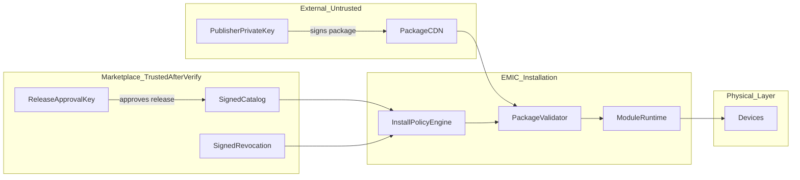

# EMIC Module Ecosystem Threat Model

**Date:** 2026-09-07  
**Scope:** Step 5C design — public module distribution, third-party publishers, Marketplace governance  
**Status:** Design artifact (not implementation)  
**Foundation:** Step 5B Internal / Trusted Module Store (production-ready per independent verification)

---

## 1. Primary Security Question

> How can EMIC safely distribute, install, update, and revoke third-party modules on many installations without a compromised publisher, Store, release channel, or module compromising the entire platform?

This document answers that question by enumerating threats, assets, actors, and mitigations mapped to existing Step 5B controls and proposed Step 5C controls.

---

## 2. Assets

| Asset | Description | Impact if compromised |
|-------|-------------|----------------------|
| **Physical devices** | EV chargers, inverters, batteries, vehicles, SPA, HVAC | Unsafe charging, energy misdirection, equipment damage |
| **Site energy data** | Consumption, production, forecasts, tariffs | Privacy breach, incorrect optimization |
| **Integration credentials** | API keys, OAuth tokens, device passwords | Lateral access to vendor systems |
| **EMIC admin authority** | Install/enable/config decisions | Full platform compromise |
| **Publisher reputation** | Trust in Official/Verified tiers | Supply-chain deception at scale |
| **Module runtime** | In-process Python code with Core access | Arbitrary code execution |
| **Secrets store** | Site-scoped secrets | Credential theft |
| **Marketplace integrity** | Catalog, release metadata, revocation feed | Mass malicious distribution |

---

## 3. Actors

| Actor | Capability | Motivation |
|-------|------------|------------|
| Malicious publisher | Submit signed packages under stolen or new identity | Device control, data exfiltration, persistence |
| Compromised publisher (legitimate) | Valid signing key, existing trust | Supply-chain attack |
| Compromised Marketplace backend | Alter catalog, metadata, approval records | Push malicious releases |
| Compromised CDN / artifact storage | Serve swapped package bytes | MITM at distribution layer |
| Network attacker (MITM) | Intercept HTTPS, replay old artifacts | Downgrade, replay |
| Malicious EMIC admin (insider) | Local admin token, break-glass | Policy bypass |
| Malicious Marketplace admin | Approve releases, revoke competitors | Kill-switch abuse, censorship |
| Offline / air-gapped attacker | Physical access to EMIC host | Stale trust exploitation |
| Community publisher (unverified) | Self-registration only | Spam, low-quality or malicious modules |

---

## 4. Trust Boundaries (Summary)

See [EMIC_MODULE_TRUST_MODEL.md](./EMIC_MODULE_TRUST_MODEL.md) for full domain definitions.



---

## 5. Threat Catalog

Each threat includes: description, STRIDE category, existing Step 5B mitigation, proposed Step 5C mitigation, residual risk.

### 5.1 Publisher & Signing

| ID | Threat | STRIDE | Step 5B | Step 5C | Residual |
|----|--------|--------|---------|---------|----------|
| T01 | **Malicious publisher** submits harmful signed package | Spoofing | Block unknown keys (`PublisherTrustStore`) | Tier policy; Verified onboarding; control-module restrictions | Medium — verified bad actor |
| T02 | **Compromised publisher key** signs malicious update | Spoofing | Key revoke → startup quarantine | Central signed revocation feed; auto-quarantine for control modules | Low–Medium |
| T03 | **Publisher impersonation** (fake publisher_id) | Spoofing | Signature binds publisher in `signature.json` | Publisher identity registry; org verification for Verified tier | Low |
| T04 | **Private key stored in EMIC** | Info disclosure | Not stored (public key only) | Policy: never store publisher private keys; optional managed HSM for Official only | Low |
| T05 | **Compromised signing pipeline** (CI/build) | Tampering | N/A (local sign) | Sigstore attestation optional for Verified; reproducible build for Official | Medium |
| T06 | **Revoked key still trusted offline** | Elevation | Startup revalidation | Revocation feed + staleness SLA; degraded mode for control modules | Medium |

### 5.2 Marketplace & Catalog

| ID | Threat | STRIDE | Step 5B | Step 5C | Residual |
|----|--------|--------|---------|---------|----------|
| T07 | **Compromised Store backend** publishes arbitrary release | Tampering | N/A | Two-party model: publisher sign + Marketplace release approval sign | Low–Medium |
| T08 | **Compromised catalog metadata** (wrong hash/URL) | Tampering | Local catalog only | **Real TUF** metadata chain (Step 5C.1); hash verified after download (5C.3) | Low |
| T09 | **MITM on catalog fetch** | MITM | N/A | HTTPS + signed metadata; artifact hash is primary integrity | Low |
| T10 | **Fabricated revocation** (fake kill-switch) | Spoofing | N/A | Revocation feed signed by Marketplace revocation key | Low |
| T11 | **Malicious marketplace admin** mass-revoke | DoS / Tampering | N/A | Scoped revocation; audit; multi-person approval for Official tier | Medium |
| T12 | **Catalog scraping / DoS** | DoS | N/A | Rate limits; CDN caching; snapshot model | Low |

### 5.3 Package Distribution

| ID | Threat | STRIDE | Step 5B | Residual |
|----|--------|--------|---------|----------|
| T13 | **CDN serves malicious ZIP** (swap bytes) | Tampering | Hash + signature verify (`compute_package_content_sha256`) | Low |
| T14 | **Replay of old signed release** | Replay | N/A → release sequence, `published_at`, revoked-version list | Low–Medium |
| T15 | **Downgrade attack** (1.2 → 1.0) | Tampering | `VERSION_DOWNGRADE_NOT_ALLOWED` | Low |
| T16 | **User-supplied arbitrary URL** | Tampering | No remote URL | URL only from signed release metadata + domain allowlist | Low |
| T17 | **Upload bomb / zip slip** | DoS | Archive limits, path safety tests | Low |

### 5.4 Module Identity & Dependencies

| ID | Threat | STRIDE | Step 5B | Step 5C | Residual |
|----|--------|--------|---------|---------|----------|
| T18 | **Module ID squatting** | Spoofing | Protected IDs (`core.*`, built-ins) | Publisher namespace registry; first-verified-owner policy | Low |
| T19 | **Dependency confusion** (resolve to wrong package) | Tampering | Explicit `module_dependencies` in manifest | No auto-resolve; dependency must match owned or Official module_id | Low |
| T20 | **Typosquatting** (`integration.chargeamp`) | Spoofing | Protected built-in list | Listing review; Official namespace reserved | Medium |
| T21 | **Supply-chain dependency compromise** | Tampering | Manifest-only deps | SBOM + advisory feed; scanner pipeline | Medium |

### 5.5 Runtime & Lateral Movement

| ID | Threat | STRIDE | Step 5B | Step 5C | Residual |
|----|--------|--------|---------|---------|----------|
| T22 | **Runtime module compromise** | Elevation | Quarantine on integrity fail | Tiered isolation; control modules in subprocess | Medium (in-process Official) |
| T23 | **Lateral access to other modules** | Elevation | Site-scoped capabilities | Process isolation for Verified control; secret broker | Medium |
| T24 | **Secret theft** | Info disclosure | Permissions declarative only | Secret broker; `secrets.read_own` enforcement in isolated runtime | Medium until Phase 5C.5 |
| T25 | **Device-control abuse** | Elevation | Capability registry | Device control broker; policy engine | Medium |
| T26 | **Persistence after revocation** | Persistence | Loader quarantine; enable block | Revocation → QUARANTINED → runtime stop | Low |
| T27 | **Sandbox escape** (future isolation) | Elevation | N/A | Minimal IPC surface; no arbitrary syscalls | TBD at implementation |

### 5.6 Operational & Offline

| ID | Threat | STRIDE | Step 5B | Step 5C | Residual |
|----|--------|--------|---------|---------|----------|
| T28 | **Stale revocation data** | Elevation | N/A | TTL SLA; degraded trust banner; control restriction | Medium |
| T29 | **Offline EMIC bricking** | DoS | Works offline | Grace period; cached snapshots; no permanent brick | Low |
| T30 | **Clock skew attacks** | Spoofing | N/A | Use signed timestamps from feed; monotonic release sequence | Low |
| T31 | **Marketplace root key compromise** | Spoofing | N/A | Offline root + online subkeys; rotation procedure | Medium |
| T32 | **Kill-switch abuse** | DoS | N/A | Scoped revocation; signed; audit; no whole-installation shutdown | Low |
| T33 | **SSRF via metadata/package URL** | Tampering | No remote URL in 5C.1 | Base URL admin-config only; artifact URLs from signed targets (5C.3); no user-supplied fetch URL | Low (5C.1) / gated 5C.3 |
| T34 | **HTTP redirect hijack** on metadata fetch | MITM / Tampering | N/A | Metadata client: **no redirects**; fail closed (5C.1) | Low |
| T35 | **DNS rebinding** against metadata endpoint | MITM | N/A | HTTPS + pinned root trust; strict URL config; isolation gates for download phase (5C.3/5C.5) | Medium (5C.3+) |
| T36 | **Freeze attack** (stale timestamp/snapshot) | Tampering | N/A | TUF timestamp expiry + snapshot binding; reject expired metadata (5C.1) | Low |

---

## 6. Attack Trees (Top 5)

### 6.1 Compromised Publisher Key

```text
Goal: Run malicious code on EMIC installations
├── Sign malicious package with compromised key
│   ├── MITIGATION: Central revocation feed → quarantine on next sync
│   └── MITIGATION: Auto-quarantine control modules (CRITICAL tier)
├── Submit as update to existing module
│   ├── MITIGATION: Permission/capability diff review
│   └── MITIGATION: Admin update approval for new permissions
└── Target installations with stale revocation cache
    ├── MITIGATION: Revocation SLA (critical: 1h)
    └── MITIGATION: Control modules restricted when feed stale
```

### 6.2 CDN Artifact Swap

```text
Goal: Install attacker-controlled bytes
├── Replace .emicpkg on CDN
│   ├── MITIGATION: content_sha256 mismatch → SIGNATURE_INVALID
│   └── MITIGATION: Package signature fails (digest includes content hash)
├── Downgrade to older vulnerable version
│   ├── MITIGATION: VERSION_DOWNGRADE_NOT_ALLOWED
│   └── MITIGATION: Revoked version list in catalog
└── Replay old HTTPS response
    └── MITIGATION: Release sequence monotonicity; revoked versions
```

### 6.3 Marketplace Backend Compromise

```text
Goal: Distribute attacker-chosen package as approved
├── Alter catalog JSON (point to malicious artifact)
│   ├── MITIGATION: Catalog snapshot signed; EMIC verifies before trust
│   └── MITIGATION: Artifact hash in signed release metadata
├── Approve release without publisher signature
│   ├── MITIGATION: Two-party model — release record needs publisher package signature
│   └── MITIGATION: Marketplace cannot re-sign as publisher
├── Revoke legitimate publisher (censorship)
│   └── MITIGATION: Audit; break-glass; org override policy (non-CRITICAL only)
└── Push fake revocation to brick modules
    └── MITIGATION: Revocation feed signed; scope limits; admin notification
```

### 6.4 Dependency Confusion

```text
Goal: Trick installer into pulling wrong dependency
├── Publish squatting module_id
│   ├── MITIGATION: Namespace registry; protected built-ins
│   └── MITIGATION: Verified publisher ownership of module listings
├── Declare dependency on ambiguous name
│   └── MITIGATION: Canonical module_id only; no registry auto-resolve
└── Transitive dependency hijack
    └── MITIGATION: SBOM; explicit dependency list in release metadata
```

### 6.5 Control-Module Lateral Movement

```text
Goal: Use installed module to control devices or steal secrets
├── Exploit in-process module (full Python access)
│   ├── MITIGATION: Verified control → subprocess isolation (Phase 5C.5)
│   └── MITIGATION: Official tier only for highest-risk until isolation ready
├── Read other modules' secrets
│   └── MITIGATION: Secret broker; scoped access
├── Invoke capabilities of other modules
│   └── MITIGATION: CapabilityRegistry site-scoped; broker for commands
└── Persist after admin disable
    └── MITIGATION: Orchestrator stop; capability unregister; quarantine
```

---

## 7. STRIDE by Subsystem

| Subsystem | Spoofing | Tampering | Repudiation | Info disclosure | DoS | Elevation |
|-----------|----------|-----------|-------------|-----------------|-----|-----------|
| Catalog API | Signed snapshots | Hash in signed metadata | Audit log | Minimal metadata | Rate limit | N/A |
| Artifact CDN | N/A | Hash + signature | N/A | N/A | Size limits | N/A |
| Revocation feed | Signed feed | Signed feed | Audit | N/A | N/A | Scoped quarantine |
| Install path | Publisher sig | Validator | Audit | Path not exposed | Lock, size | Policy engine |
| Runtime | N/A | Loader revalidate | Heartbeat | Secret broker | Crash | Isolation tier |
| Device control | N/A | Broker policy | Audit | N/A | Safe-state stop | Capability gate |

---

## 8. Mitigation Mapping

| Control | Step 5B (exists) | Step 5C (design) |
|---------|------------------|------------------|
| Ed25519 package signing | Yes | Retain |
| Publisher trust store | Yes (DB) | Extend with tiers + central sync |
| Startup integrity revalidation | Yes | Retain + revocation check |
| Quarantine | Yes | Retain + emergency policy |
| Admin-only mutations | Yes | Retain |
| Permission allowlist (install) | Yes | Retain + diff on update |
| Protected module IDs | Yes | Retain + namespace registry |
| Downgrade block | Yes | Retain |
| Signed catalog | No | **Real TUF** metadata (Step 5C.1) |
| Signed revocation | No | Signed feed |
| Two-party release approval | No | Marketplace release signature |
| Install policy engine | No | Org tier + allowlist |
| Runtime isolation | No | Tiered (subprocess for Verified control) |
| Secret/network broker | No | Phase 5C.5 |
| SBOM / advisories | No | Phase 5C.4 |

---

## 9. Residual Risk Register

| ID | Risk | Severity | Owner | Accept / Mitigate |
|----|------|----------|-------|-------------------|
| R01 | Official modules remain in-process | Medium | Platform | Accept for Official; isolate Verified control |
| R02 | Revocation stale on offline install | Medium | Operations | Degraded mode + SLA |
| R03 | Verified publisher turns malicious | Medium | Marketplace ops | Revocation + monitoring |
| R04 | Permission enforcement install-only until 5C.5 | Medium | Platform | Roadmap broker enforcement |
| R05 | Community tier abuse in dev | Low | Policy | Block prod install |
| R06 | Marketplace root key compromise | High | Security | Offline root + rotation IR |

---

## 10. Red Team Checklist (Future)

Design verification and pre-implementation red team should exercise:

- [ ] Malicious signed catalog snapshot (wrong hash)
- [ ] MITM artifact with valid HTTPS, wrong bytes
- [ ] Replay of revoked but correctly signed release
- [ ] Dependency confusion via squatting module_id
- [ ] Revoked key used before feed sync
- [ ] Permission escalation in update (new `device.control`)
- [ ] Control module command without capability
- [ ] Secret access outside broker
- [ ] Kill-switch scope (must not stop entire EMIC)
- [ ] Offline installation beyond revocation SLA

---

## 11. References

- [EMIC_MODULE_TRUST_MODEL.md](./EMIC_MODULE_TRUST_MODEL.md)
- [EMIC_MODULAR_ARCHITECTURE_STEP5B.md](../architecture/EMIC_MODULAR_ARCHITECTURE_STEP5B.md)
- [EMIC_STEP5B_VERIFICATION.md](../architecture/EMIC_STEP5B_VERIFICATION.md)
- [docs/module-sdk/security.md](../module-sdk/security.md)
