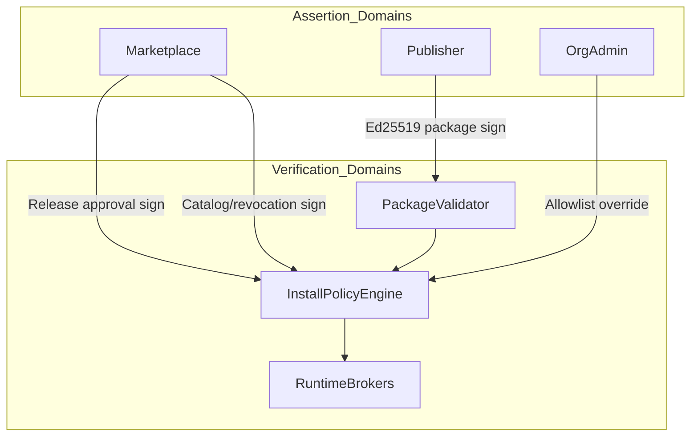
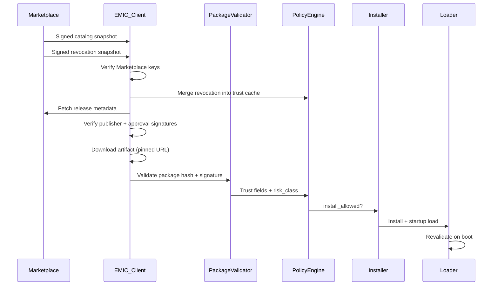

# EMIC Module Trust Model

**Date:** 2026-09-07  
**Scope:** Step 5C design — trust domains, publisher tiers, field separation, fail-safe behavior  
**Status:** Design artifact  
**Related:** [EMIC_MODULE_ECOSYSTEM_THREAT_MODEL.md](./EMIC_MODULE_ECOSYSTEM_THREAT_MODEL.md), [EMIC_MODULAR_ARCHITECTURE_STEP5C.md](../architecture/EMIC_MODULAR_ARCHITECTURE_STEP5C.md)

---

## 1. Purpose

Define how EMIC separates **who signed**, **who approved**, **who is trusted**, and **what may install/run** — without collapsing these into a single boolean. Step 5B established four trust dimensions in `ValidationResult`; Step 5C extends them for public ecosystem governance.

---

## 2. Trust Domains

| Domain | May assert | Must verify | Never assert |
|--------|------------|-------------|--------------|
| **EMIC Core** | Platform capabilities, protected IDs, install policy | Publisher signatures, catalog signatures | Publisher identity |
| **Official Publisher** | Package bytes, manifest | Marketplace approval (for remote) | Other publishers' modules |
| **Verified Publisher** | Package bytes under verified org identity | Marketplace approval, org policy | Official namespace |
| **Community Publisher** | Package bytes (dev/lab) | All higher tiers | Production install |
| **Marketplace Backend** | Catalog, release approval, revocation | Publisher package signature | Package content (no re-sign as publisher) |
| **Catalog Service** | Module listings, release metadata pointers | Publisher signatures on releases | Artifact integrity (delegated to hash+sig) |
| **CDN / Artifact Storage** | Opaque bytes at URL | Nothing | Trust, approval, identity |
| **Installation Client** | Local install decision | All upstream signatures + policy | Publisher tier without verification |
| **Module Runtime** | Health, capabilities at runtime | Permissions, site scope | Cross-site data |
| **Device / Site** | Physical state | Command authorization | Software trust |
| **Secrets Store** | Secret values to authorized callers | Caller identity + scope | Secrets to unscoped modules |
| **Admin / Operator** | Local policy override (non-CRITICAL) | Audit requirements | Revocation of CRITICAL without feed |

---

## 3. Publisher Trust Tiers

| Tier | Identity proof | Default prod install | Control-capable modules | Runtime mode |
|------|------------------|----------------------|-------------------------|--------------|
| `OFFICIAL` | EMIC-operated keys | Allowed | Allowed | In-process |
| `VERIFIED` | Org verification (legal entity, domain, manual review) | Org policy (default allow for allowlisted orgs) | Allowed with subprocess isolation (Phase 5C.5) | Tiered |
| `ORG_APPROVED` | Admin allowlisted publisher on this installation/org | Per-org allowlist | Policy-dependent | Tiered |
| `COMMUNITY` | Self-registered, email only | **Blocked in production** | N/A | Dev/lab only |
| `REVOKED` | Any revoked publisher/key/module/version | Blocked + quarantine | N/A | Stopped |

### 3.1 Tier promotion rules (design)

- **COMMUNITY → ORG_APPROVED:** Local admin adds publisher public key to org allowlist (Step 5B model).
- **ORG_APPROVED → VERIFIED:** Marketplace verification workflow (identity docs, domain DNS, security review).
- **VERIFIED → OFFICIAL:** EMIC internal only; not available to third parties.

### 3.2 Control-capable module requirements

Modules declaring capabilities in classes `device.control`, energy control (e.g. `charger.command`, `vehicle.command`, `spa.control`), or permissions `device.control` / write-class permissions require:

- Publisher tier `OFFICIAL` or `VERIFIED`
- Marketplace `release_approved` signature
- For `VERIFIED`: subprocess isolation when Phase 5C.5 is deployed; until then, org explicit opt-in with audit

**Execution gate (H-01 — design rule, Step 5C.1 doc fix):**

> No `VERIFIED` or `ORG_APPROVED` **control-capable** module may **RUN in production** before the **Step 5C.5 isolation gate** passes.

Step 5C.1 metadata trust does not relax this rule.

### 3.3 Ownership transfer gate (M-03 — Step 5C.2)

Publisher/module ownership transfer is implemented via `module_ownership_transfers` with admin approval. See [EMIC_PUBLISHER_GOVERNANCE.md](./EMIC_PUBLISHER_GOVERNANCE.md) §6.

**No trust escalation:** completed transfers re-evaluate tier from the target publisher only.

### 3.4 Policy engine outputs (M-06 — Step 5C.2)

`ModuleInstallPolicyEngine` emits explicit decisions on evaluate/dry-run:

| Output | Meaning |
|--------|---------|
| `ALLOW` | Policy permits (evaluate-only in 5C.2) |
| `DENY` | Policy blocks |
| `REQUIRE_ADMIN_APPROVAL` | Reserved |
| `REQUIRE_SECURITY_REVIEW` | Reserved |

See [EMIC_ORGANIZATION_MODULE_POLICY.md](./EMIC_ORGANIZATION_MODULE_POLICY.md). `install_allowed` remains on crypto/trust-store path until a later step enables enforcement.

### 3.6 Security advisories (M-01)

Future security advisories for modules **must** be distributed via the **signed TUF metadata chain** (catalog or dedicated targets role entry), not unsigned HTTP feeds or UI-only banners. No advisory implementation in Step 5C.1.

### 3.5 TLS policy for Marketplace metadata (M-07)

| Rule | Step 5C.1 |
|------|-----------|
| HTTPS required in production | Yes (`require_https`) |
| Redirect policy | No redirects on metadata fetch |
| Certificate rotation | Standard PKI; trust from TUF not TLS pin |
| TLS pinning | Optional / managed — not required for metadata trust |

## 4. Trust Field Separation

Step 5B `ValidationResult` fields (see `packages/energy-core/.../types.py`):

| Field | Meaning | Set by |
|-------|---------|--------|
| `signed` | Package contains signature metadata | Validator (parse) |
| `signature_valid` | Ed25519 verifies over canonical digest | Validator (crypto) |
| `publisher_identity_valid` | Key matches registered publisher for `publisher_id` | Trust store lookup |
| `publisher_trusted` | Key trusted for this installation (allowlist/tier) | Trust store + policy |
| `install_allowed` | Combined gate for install/update | Validator + policy engine |

Step 5C **extends** with separate fields (design — not yet in code):

| Field | Meaning | Set by |
|-------|---------|--------|
| `release_approved` | Marketplace signed release approval record | Catalog client |
| `revocation_status` | `ACTIVE`, `REVOKED_PUBLISHER`, `REVOKED_KEY`, `REVOKED_VERSION`, `REVOKED_HASH` | Revocation feed merge |
| `policy_allowed` | Org install policy (tier, allowlist, control rules) | Install policy engine |
| `risk_class` | `CRITICAL`, `HIGH`, `NORMAL`, `LOW` (from capabilities + publisher tier) | Policy engine |
| `catalog_trusted` | Catalog snapshot signature valid | Catalog client |
| `artifact_pinned` | Download URL matches signed release metadata | Install client |

**Rule:** No single field implies another. Example: `signature_valid=true` + `publisher_trusted=false` → install blocked but package cryptographically authentic.

---

## 5. Fail-Safe Matrix

Behavior when subsystems are unavailable or verification fails.

| Condition | Catalog | Revocation | Validator | Runtime | Default behavior |
|-----------|---------|------------|-----------|---------|------------------|
| Catalog unavailable | ✗ | OK | OK | OK | Use cached snapshot; if none → remote install blocked; local upload unchanged |
| Revocation stale (> SLA) | OK | ✗ | OK | OK | **Degraded:** banner; CRITICAL control modules → stop new commands; existing may continue per org policy |
| Revocation stale (> 7d offline grace) | OK | ✗✗ | OK | OK | Block new remote installs; quarantine CRITICAL modules without fresh feed |
| Signature invalid | OK | OK | ✗ | — | Install blocked; existing → quarantine on startup |
| Publisher untrusted | OK | OK | partial | — | Install blocked |
| Release not approved | ✗ | OK | OK | — | Remote install blocked |
| Marketplace root key rotate | transitional | transitional | OK | OK | Support key hierarchy; overlap period for old root |
| Verification failure at startup | — | — | ✗ | — | QUARANTINED; module not loaded |
| Admin break-glass override | — | — | — | OK | Allowed for NON-CRITICAL only; full audit |

### 5.1 Revocation staleness SLA

| Risk class | Max staleness before degraded | Max offline grace |
|------------|--------------------------------|-------------------|
| CRITICAL (device control) | 1 hour | 24 hours (commands restricted) |
| HIGH (external network, secrets) | 6 hours | 72 hours |
| NORMAL | 24 hours | 7 days |
| LOW (read-only telemetry) | 24 hours | 7 days |

---

## 6. §141 Open Questions — Decision Answers

Each decision: **Recommendation**, **Alternatives**, **Reasoning**.

### Q1: Allow third-party modules in-process?

**Recommendation:** Tiered — OFFICIAL in-process; VERIFIED read-only/telemetry in-process with broker-enforced permissions (Phase 1); VERIFIED control modules in subprocess (Phase 5C.5).

**Alternatives:** All third-party in containers; all in-process with seccomp; WASM-only modules.

**Reasoning:** Step 5B pipeline is in-process and production-proven. Full container isolation adds deployment complexity on edge hardware. Subprocess + IPC balances security and hardware access for control modules.

### Q2: Must control modules be Official or Verified?

**Recommendation:** Yes. `device.control` and equivalent energy control capabilities require `OFFICIAL` or `VERIFIED` tier.

**Alternatives:** ORG_APPROVED with admin waiver; capability-based only without tier.

**Reasoning:** Physical impact requires identity accountability and central revocation. Community/self-serve is insufficient.

### Q3: Use TUF?

**Recommendation:** Yes for catalog and revocation **metadata snapshots** only — not for package format.

**Alternatives:** Custom signed JSON; full TUF with delegated targets per package; no central catalog (pure P2P).

**Reasoning:** TUF provides well-understood snapshot/expiry semantics and offline caching. Package format already uses Ed25519 direct signing; do not wrap packages in TUF targets.

### Q4: Use Sigstore?

**Recommendation:** Optional future phase for VERIFIED publisher build attestation (cosign/rekor). Not required for v1 public marketplace.

**Alternatives:** Mandatory Sigstore for all tiers; no attestation.

**Reasoning:** Reduces v1 complexity. Ed25519 publisher signing + Marketplace approval sufficient for initial launch. Sigstore adds value for CI compromise detection.

### Q5: Central revocation auto-stop modules?

**Recommendation:** Risk-class dependent. CRITICAL control → auto-quarantine on revocation sync. HIGH/NORMAL → notify admin; quarantine after configurable grace unless org policy says immediate.

**Alternatives:** Always auto-stop; never auto-stop (notify only).

**Reasoning:** Balance safety vs availability. Charger stop on compromised module is correct; read-only telemetry module may tolerate delayed action.

### Q6: Revocation staleness TTL?

**Recommendation:** See §5.1 table (1h / 6h / 24h by risk class; 7d offline grace with restrictions).

**Alternatives:** Single global 24h; no staleness checks.

**Reasoning:** Control modules need fresher trust state; offline EMIC must not brick.

### Q7: Offline installation behavior?

**Recommendation:** Cached signed catalog + revocation valid within grace; new remote installs require fresh metadata or air-gapped import bundle signed by Marketplace.

**Alternatives:** No offline remote install ever; unlimited offline trust.

**Reasoning:** Field deployments are often air-gapped. Import bundle path mirrors TUF offline root transfer.

### Q8: Marketplace root key compromise?

**Recommendation:** Multi-key hierarchy: offline root → online catalog signing key + online revocation signing key. Documented rotation and incident response; EMIC ships trust root pins with update channel.

**Alternatives:** Single key; HSM-only root with no rotation plan.

**Reasoning:** Limits blast radius; supports rotation without bricking installations.

### Q9: Org admin override revocation?

**Recommendation:** No override for CRITICAL revocations. Yes with audit and break-glass policy for NORMAL tier (e.g. false positive publisher revoke).

**Alternatives:** Full admin override always; no override ever.

**Reasoning:** CRITICAL revocations protect physical safety. NORMAL false positives should not require EMIC HQ intervention.

### Q10: Dependency confusion prevention?

**Recommendation:** Canonical `module_id` registry; publisher owns namespace; dependencies must reference owned, Official, or explicitly allowlisted modules; no npm-style auto-resolve.

**Alternatives:** Lockfile only; trust all signed deps.

**Reasoning:** Explicit ownership prevents squatting and transitive hijack.

### Q11: Permission enforcement timing?

**Recommendation:** Phase 1 — install-time + policy engine (Step 5B + 5C policy). Phase 2 — broker enforcement in isolated runtime (5C.5).

**Alternatives:** Install-time only indefinitely; kernel-level enforcement day one.

**Reasoning:** Incremental path aligned with isolation rollout.

---

## 7. Trust Boundaries Diagram (Installation Flow)

---

## 8. Mapping to Step 5B Implementation

| Step 5C concept | Step 5B location |
|-----------------|------------------|
| `publisher_trusted` | `PublisherTrustStore`, `module_publisher_keys` |
| `signature_valid` | `PackageValidator`, `signing.py` |
| `install_allowed` | Validator + admin upload path |
| Quarantine on fail | `quarantine.py`, loader startup |
| Trust UI fields | `trust_read_model.py` |
| Permissions install-time | `permissions.py` allowlist |

---

## 9. References

- [EMIC_MODULE_ECOSYSTEM_THREAT_MODEL.md](./EMIC_MODULE_ECOSYSTEM_THREAT_MODEL.md)
- [EMIC_MODULAR_ARCHITECTURE_STEP5C.md](../architecture/EMIC_MODULAR_ARCHITECTURE_STEP5C.md)
- [docs/module-sdk/security.md](../module-sdk/security.md)
- [docs/module-sdk/permissions.md](../module-sdk/permissions.md)
